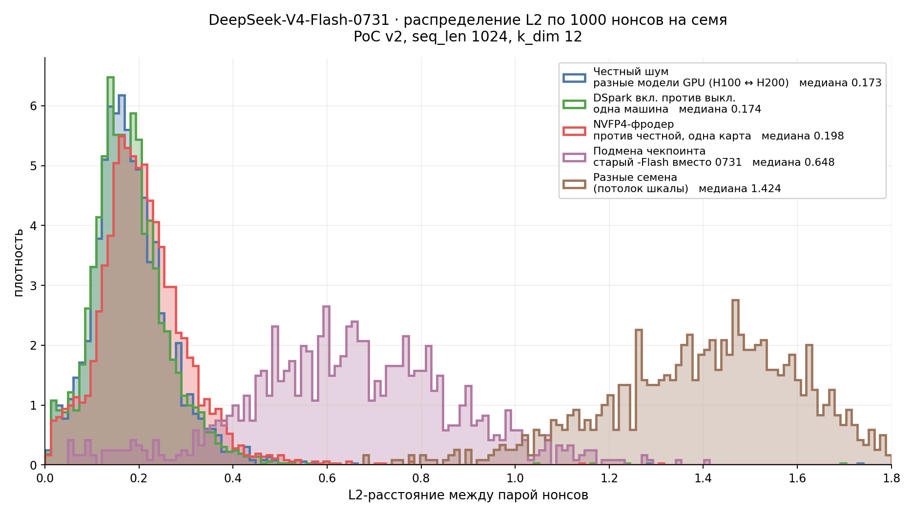

# NVFP4 against 0731 on 1×B300: +63 % PoC, still hidden in the noise — and it cannot speculate

**Date:** 2026-08-01
**Honest model:** `deepseek-ai/DeepSeek-V4-Flash-0731` @ `9e165c30e2704aec5d9d593cce3eebd58bbef1cb`
**Candidate:** `MJPansa/DeepSeek-V4-Flash-0731-NVFP4` (175.6 GB, `quant_method: fp8, group_size: 16`)
**Hardware:** 1× NVIDIA B300 SXM6 AC 275 GB (1100 W), TP=1, driver 580.126.09, CUDA 13
**Image:** `mlnode-b300-deepseek-v4-flash:0.2.14-vllm0.25.1-overlay-k10`
**Digest:** `sha256:a6213dac621c1634a82940533190c9a5149b6535a5690c69ca6d3919c74c8138`

> V4 thresholds are **not calibrated**. L2 values are distances; the p-values are quoted under
> the parameters this series has used throughout (`dist_threshold 0.40, p_mismatch 0.10`),
> not as a network policy.

Four configurations on one card: honest and NVFP4, each with DSpark off and on. Both
checkpoints measured back to back on the same GPU, same seeds, same instrument.

## Summary

- **The July fraud vector survives the checkpoint refresh, unchanged in profit.** NVFP4 gives
  **2816 nonces/min against 1728 honest — +63.0 %**. In July, on the previous checkpoint and
  this same card, it was 2720 against 1664: also +63 %.
- **Its separation from honest noise is unchanged — slightly better, if anything.** Median L2
  **0.196–0.200** at **2.5–3.0 %** mismatches, against an honest floor measured on this same
  checkpoint of **0.173 at 1.3–1.9 %**. In July, on the previous checkpoint, NVFP4 sat at
  0.199–0.210 at 4.1–5.1 % against a 0.188 floor. Both moved down together; the gap went from
  0.015 to 0.025. The distributions still overlap, so a threshold still cannot separate them —
  but the refresh did not widen the hole.
- **But NVFP4 cannot use DSpark.** Acceptance collapses to **1.14–1.24 tokens per step**
  against 3.6–6.0 for the honest checkpoint, and enabling speculation makes serving *slower*.
  An honest node with DSpark delivers 429 tok/s in long single-stream decode; the NVFP4 node
  delivers 135 — **3.2× less**.
- That gives the network a **behavioural** signal where L2 gives none: a node with high PoC
  whose decode timing is non-speculative is suspicious even though its vectors look clean.

## Result 1 — PoC throughput

Nonces/min, `run_pow_generation.py --phase 3`:

| batch | honest | honest + DSpark | **NVFP4** | NVFP4 + DSpark |
|---:|---:|---:|---:|---:|
| 8 | 1504 | 1648 | 2576 | 2576 |
| 16 | 1696 | 1696 | 2752 | 2752 |
| 32 | **1728** | **1728** | **2816** | **2816** |

Two things at once. DSpark is PoC-neutral on both checkpoints — 1728 either way, 2816 either
way — which repeats on a third topology what 2×H200 (1215/1216) and 4×H100 (1504/1504) showed.
And the honest 1728 matches the July reference for this card exactly, so the refresh does not
move node weight.

**NVFP4 earns 63 % more weight for the same hardware.**

## Result 2 — is it detectable?



The picture is the argument: the NVFP4 curve sits *inside* the honest ones rather than beside
them. Checkpoint substitution and a foreign seed are separated by any threshold; NVFP4 is not
separated by one. Pooled over the seeds available for each comparison
(`scripts/plot_l2_distributions.py`, reading the committed artifacts of this and the two
companion folders):

| comparison | n | median | > 0.4 |
|---|---:|---:|---:|
| honest noise, different GPU models (H100 ↔ H200) | 3000 | 0.173 | 1.6 % |
| DSpark on vs off, one machine | 3000 | 0.174 | 1.7 % |
| **NVFP4 vs honest, one card** | 3000 | **0.198** | 2.8 % |
| checkpoint substitution — old `-Flash` for 0731 | 1000 | 0.648 | 88.6 % |
| different seeds (scale ceiling) | 1000 | 1.424 | 100 % |

Note the first two rows: enabling speculation moves the vectors **exactly as much as swapping
the GPU model does**. That is the practical licence to roll DSpark out across a mixed fleet.


NVFP4 against honest, same card, same three seeds, both without speculation:

| seed | n | median L2 | p95 | mismatches > 0.4 | p-value |
|---|---:|---:|---:|---:|---:|
| s1 | 1000 | 0.1997 | 0.362 | 25 (2.5 %) | 1.000 |
| s2 | 1000 | 0.1985 | 0.372 | 30 (3.0 %) | 1.000 |
| s3 | 1000 | 0.1961 | 0.368 | 29 (2.9 %) | 1.000 |
| *honest floor, for scale* | | *0.188* | | *2.5–3.8 %* | |

**The distributions overlap.** NVFP4's median sits at 0.198 against an honest floor of 0.173
measured on this same checkpoint (H100 ↔ H200, `../deepseek-v4-flash-0731-dspark-4xh100`),
i.e. about 14 % above it, with tails that run into each other. A single-sample threshold cannot
separate the two; only an aggregate over many nonces can, and that is what the binomial test is
for — which, at `p_mismatch = 0.10`, returns 1.000 here.

**Compared with July, the separation did not get worse.** On the previous checkpoint NVFP4
measured 0.199–0.210 at 4.1–5.1 % against a 0.188 floor; now it is 0.196–0.200 at 2.5–3.0 %
against a 0.173 floor. Both the fraud and the floor moved down, and the absolute gap grew from
0.015 to 0.025. An earlier revision of this report claimed the opposite by comparing the new
mismatch rate against the *old* floor's range — that was a reading error, not a measurement.

**One caveat on what was measured.** NVFP4 is compared against honest on the *same card*, which
isolates the quantisation effect. A real validator runs elsewhere and sees quantisation *plus*
cross-machine noise summed. That pairing — NVFP4 on one GPU model against honest on another —
is not in this run and should be measured before any threshold is set.

For scale, the rest of the ladder measured in this series: repeat on the same GPU 0.000,
honest across GPU models 0.188, **NVFP4 0.197**, INT4 0.296, wrong checkpoint 0.443, foreign
model ~1.41.

## Result 3 — the cost the fraudster pays: no speculative decoding

Serving, tokens/s (`tok/chunk` is the observed acceptance — 1.00 means no speculation):

| scenario | honest | honest + DSpark | NVFP4 | NVFP4 + DSpark |
|---|---:|---:|---:|---:|
| s1 — 20k prompt, sequential, 300 tok | 81.4 | **304.7** | 142.4 | 130.8 |
| s2 — 2k prompt, concurrency 30 | 1328.9 | 1301.2 | **1598.5** | 1148.8 |
| s3 — 45k prompt, sequential, 1000 tok | 143.0 | **429.4** | 144.8 | 135.0 |
| s4 — 45k prompt, concurrency 20 | 1039.8 | **2180.0** | 1163.7 | 974.8 |

| acceptance (tok/chunk) | honest + DSpark | NVFP4 + DSpark |
|---|---:|---:|
| s1 / s2 / s3 / s4 | 5.37 / 3.64 / 6.04 / 5.69 | **1.21 / 1.14 / 1.24 / 1.22** |

Zero failed requests in all sixteen measurements.

Raw NVFP4 is genuinely faster than raw honest — 1598 vs 1329 in s2, +20 %. But the draft model
inside the quantised checkpoint is almost never accepted, so DSpark degenerates into pure
overhead: every NVFP4 + DSpark cell is *worse* than NVFP4 alone. Against an honest node that
does speculate, the fraudster loses badly wherever decode dominates.

**So the economics are two-sided.** The fraud buys 63 % more PoC weight at no detection risk,
and costs a 3.2× deficit in long-form serving throughput. A reward that weighs delivered
service, not only PoC, prices this vector out on its own.

## Result 4 — DSpark on the honest checkpoint, third topology

| scenario | off → on | × | acceptance |
|---|---|---:|---:|
| s1 — 20k, sequential | 81.4 → 304.7 | **3.74×** | 5.37 |
| s2 — 2k, concurrency 30 | 1328.9 → 1301.2 | **0.98×** | 3.64 |
| s3 — 45k, sequential | 143.0 → 429.4 | **3.00×** | 6.04 |
| s4 — 45k, concurrency 20 | 1039.8 → 2180.0 | **2.10×** | 5.69 |

Consistent with 2×H200 and 4×H100: three to four times in single-stream decode, nothing under
short high-concurrency load. On this card s2 is the first cell in the series where DSpark is
mildly **negative** (0.98×) — at concurrency 30 with 2k prompts there is no launch overhead
left to remove, and the draft model still costs cycles.

KV cost of DSpark here: 2,211,880 tokens against 2,660,974 — −16.9 %, in line with the −13.8 %
measured on H200.

## Environment

`artifacts/logs/env_b300.txt`. Engine args, identical across all four arms except the
speculative flag: `--tensor-parallel-size 1 --gpu-memory-utilization 0.90 --max-model-len
400000 --max-num-batched-tokens 32768 --kv-cache-dtype fp8 --logprobs-mode processed_logprobs
--worker-extension-cls gonka_poc.worker.PoCWorkerExtension --trust-remote-code`.

The k10 image needs two fixes before it runs at all, both carried in `scripts/b300_setup.sh`
and documented in `../deepseek-v4-flash-0731-2xh200`: a `libnvrtc.so` symlink, and
`VLLM_USE_V2_MODEL_RUNNER=1` (the image ships `0`, which disables every form of speculative
decoding).

## What is missing from this folder, and why

The host went offline immediately after the run finished, during artifact retrieval. What was
already local is complete for every claim above; what was not is listed here rather than
quietly omitted:

- **Nonce sets for the two DSpark-on arms** were not retrieved. They are not load-bearing: the
  fraud comparison uses the no-speculation arms on both checkpoints, and DSpark's neutrality on
  nonce *values* was established on 2×H200 and 4×H100 with six sets each.
- **Serving JSONs for three of the four arms** were not retrieved. Their numbers are recovered
  from the run logs into `artifacts/serving_from_logs.json`; the per-scenario values quoted
  above come from there, and `artifacts/serving_official_dspark_off.json` is the one raw file
  that did transfer, for cross-checking the reconstruction.
- **TTFT and TPOT** are consequently available only for the arm whose raw JSON survived.

## Files

| path | what |
|---|---|
| `artifacts/summary.json` | every table above, machine-readable |
| `artifacts/l2_distributions_0731.png` | the distribution figure |
| `scripts/plot_l2_distributions.py` | regenerates the figure from committed artifacts |
| `artifacts/nonces_{official,nvfp4}_dspark_off_{s1,s2,s3}.json` | 6 × 1000 nonces, batch 32, three seeds |
| `artifacts/serving_from_logs.json` | 16 serving measurements recovered from the run logs |
| `artifacts/serving_official_dspark_off.json` | the one raw serving JSON that transferred |
| `artifacts/logs/b300_run.log`, `artifacts/logs/b300_nvfp4.log` | both runs, sweeps and serving inline |
| `artifacts/logs/api_b300.log` | engine log across all four bring-ups |
| `artifacts/logs/env_b300.txt` | hardware, versions, engine args, measured KV |
| `scripts/b300_setup.sh` | container preparation on our own box, incl. both k10 fixes |
| `scripts/b300_run.sh` | the four-arm driver (`MODEL` / `TAGPREFIX` select the checkpoint) |
| `scripts/serving_bench.py`, `scripts/collect_artifacts.py`, `scripts/run_pow_generation.py` | instruments |
| `scripts/l2_crossval.py`, `scripts/poc_seeds.json` | analysis and the fixed seed set |

`run_pow_generation.py` hardcodes the model name; the NVFP4 arm needs it edited, otherwise the
PoC plugin answers `409 params mismatch`.

## Reproduce

```bash
bash scripts/b300_setup.sh                                   # container, fixes, weights, API
MODEL=deepseek-ai/DeepSeek-V4-Flash-0731 TAGPREFIX=official bash scripts/b300_run.sh
# edit MODEL_NAME in run_pow_generation.py, then:
MODEL=MJPansa/DeepSeek-V4-Flash-0731-NVFP4 TAGPREFIX=nvfp4 bash scripts/b300_run.sh
```

## Reproducibility checklist

- [x] Both checkpoints measured on the same card, same seeds, same instrument, back to back
- [x] Image pinned by digest; honest model pinned by revision
- [x] Stock vLLM — no source patches
- [x] Three independent seeds behind the detection claim
- [x] Acceptance reported directly (tok/chunk), so "speculation is off" is observed, not assumed
- [x] Numbers regenerated from committed artifacts and logs
- [x] Unretrieved artifacts named explicitly, with what they would and would not have changed
- [x] No links to `.claude/`, no absolute local paths, no host addresses
- [x] p-values quoted with their parameters; no calibrated threshold asserted
