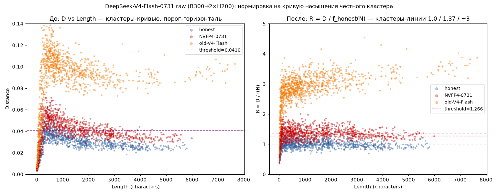
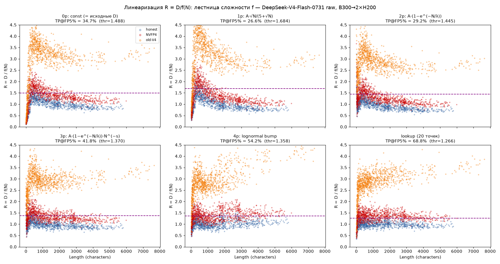
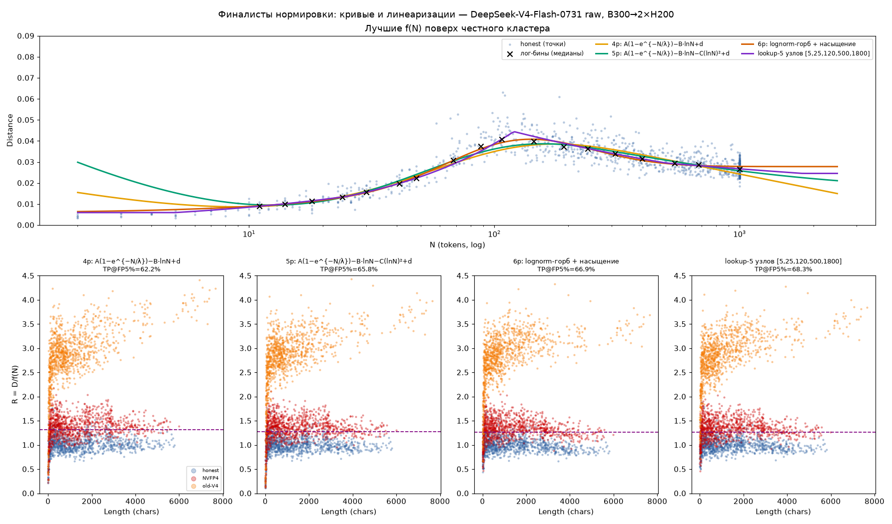

# Length-Normalized Fraud Threshold for Replay Distance

**Date:** 2026-08-03
**Data:** artifacts of [`../deepseek-v4-flash-0731-inference-validation`](../deepseek-v4-flash-0731-inference-validation) (exp2, raw_logprobs, B300 TP1 → 2×H200 TP2) — fit and scoring; [`../../2026-07/deepseek-v4-flash-inference-validation`](../../2026-07/deepseek-v4-flash-inference-validation) (same pair, previous checkpoint) — independent transfer check.
**Reproduce:** `scripts/fit_normalization.py` regenerates every number below.

## Problem

The length-vs-distance scatter shows three cluster *curves* (honest /
NVFP4 / old checkpoint), each rising from ~0 on short replies to a hump
around N≈200 tokens and drifting down toward a plateau. A **horizontal**
distance threshold cannot follow that shape: on long replies the NVFP4
cluster slides *under* it, so TP at FP=5% is stuck at **34.7%**.

## Result in one line

The clusters are multiplicative copies of one shape, `D ≈ k_cluster · f(N)`.
Dividing by the honest shape — `R = D / f_honest(N)` — turns every cluster
into a horizontal band (honest ≈ 1.0, NVFP4 ≈ 1.37, old-V4 ≈ 3) and a
constant threshold on `R` **doubles detection: TP 34.7% → 68.8%** at the
same FP=5%.



## How much shape f(N) needs: the parameter ladder

Each f is fitted to per-log-bin medians of the honest cluster (log-space
LSQ); scored by TP at FP=5% (threshold = 95th pct of honest `R`).
Validation column: the *same fitted f, no recalibration*, applied to the
July campaign (independent run, previous checkpoint, same hardware pair).

| f(N) | params | TP fit set | TP val set |
| --- | --- | --- | --- |
| constant (no normalization) | 0 | 34.7% | 44.7% |
| best 1p (`A·√N/(5+√N)`) | 1 | 26.6% ↓ | — |
| best 2p (`A·(1−e^{−N/λ})`) | 2 | 29.2% ↓ | — |
| best 3p (`A·(1−e^{−N/λ})·N^{−s}`) | 3 | 41.8% | — |
| best 4p (`A·(1−e^{−N/λ}) − B·lnN + d`) | 4 | 63.4% | 54.2% |
| best 5p (`… − C·(lnN)² + d`) | 5 | 65.8% | 63.1% |
| best 6p (lognormal bump + saturation) | 6 | 66.9% | 63.3% |
| **lookup-5** (fixed knots `[5,25,120,500,1800]`) | 5 | **68.3%** | 62.4% |
| lookup-20 (full binned curve) | ~20 | 68.8% | 64.0% |




Three findings the ladder pins down:

1. **Under-fitted normalization is worse than none.** Pure saturations
   (1–2 params) *lower* TP below the horizontal baseline: a wrong f tilts
   the honest band, inflates its 95th percentile, and lifts the threshold.
   Normalize well or not at all.
2. **The jump happens at the hump.** TP breaks away from the baseline
   exactly when the form can express a rise *and* a decay (3+ params);
   the additive decomposition `saturation − log-drift` beats every
   multiplicative bump family tried (9 four-param families compared).
3. **The curve is exhausted at ~5 parameters.** 5p → 6p adds nothing;
   6p → lookup-20 adds 1–2 pp. The ceiling is set by cluster noise, not
   by the shape.

## Transferability

- **Across runs/checkpoints (same pair):** the August fit applied to the
  July campaign unchanged loses only 1–3 pp against July's own ceiling
  (64.0% vs 67.4%). The scale factor between the two runs is 0.934 — form
  and scale both carry over on one hardware pair.
- **Across hardware pairs:** plateaus differ up to **5×** between pairs
  (0.028 B300→H200 … 0.144 B200→H200, per `token_distance2` on the honest
  artifacts of the GLM/Kimi/MiniMax campaigns) — the *scale* is
  kernel-pair-specific and must be calibrated per pair. The *shape* below
  N≈128 cannot be checked cross-pair yet: every older campaign starts at
  ~100+ tokens, so the hump region only exists in B300→H200 data. On the
  shared N≥128 range all five pairs are flat within ±8%.

## Recommendation

- **Production:** `R = D / (scale_pair · shape(N))` with `shape` =
  lookup-5 on fixed knots `[5, 25, 120, 500, 1800]` (values below), and
  `scale_pair` calibrated from ~50–100 honest self-replays on the
  validator's own pair. Constant threshold on `R` (1.27 at FP=5% on this
  data). `np.interp` in log-log; clip N to [2, 4000].
- **Documentation / smooth fallback:**
  `f(N) = 0.0902·(1−e^{−N/48.1}) − 0.0247·lnN + 0.0013·(lnN)² + 0.0427`
  (the 5p form; steadiest fit-vs-validation balance of the smooth
  candidates).
- Replies shorter than ~8 tokens are undecidable — all clusters overlap
  there regardless of normalization; exclude them from the fraud test.

Fitted values (from `fit_normalization.py`):

```
4p:       A=0.07414  λ=56.17   B=0.01006  d=0.01991
5p:       A=0.09024  λ=48.09   B=0.02465  C=-0.00132  d=0.04265
6p:       A=0.01609  m=4.796   s=0.6512   E=0.02205  λ=66.41  d=0.00576
lookup-5: knots [5, 25, 120, 500, 1800]
          values [0.00594, 0.01366, 0.04446, 0.02953, 0.02457]
```

## Files

```
├── README.md
├── artifacts/
│   ├── normalized_threshold.png     before/after, lookup-20
│   ├── ladder_linearization.png     0p…4p + lookup panels
│   ├── champion_4p.png              best 4-param form
│   └── finalists.png                4p/5p/6p/lookup-5 curves + linearizations
└── scripts/
    └── fit_normalization.py         reproduces every number above
```
