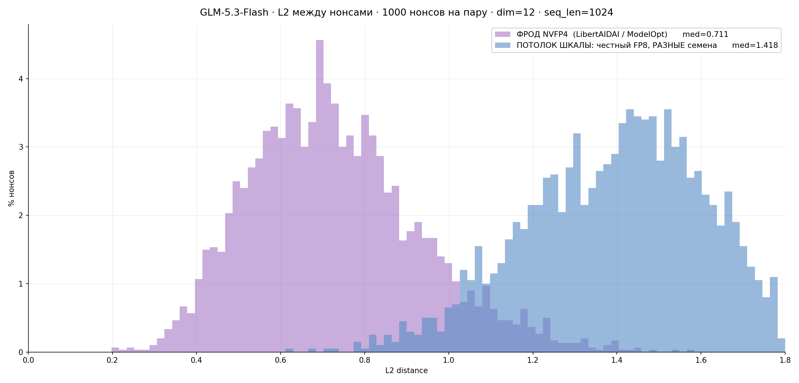

# GLM-5.3-Flash — 2×B300 — NVFP4 fraud (L2 0.711, loudest fraud we have measured; +36 % PoC; TP=1 impossible)

**Date:** 2026-08-26
**Model (fraud):** [`LibertAIDAI/GLM-5.3-Flash-NVFP4`](https://huggingface.co/LibertAIDAI/GLM-5.3-Flash-NVFP4)
— NVFP4 via ModelOpt 0.45.0 (`quant_algo: NVFP4`, `quant_method: modelopt`).
Snapshot `11d73216cd636238e82e1d77fe1042ffab36e7fa`, 183 GB, 120 shards.
**Model (reference):** `zai-org/GLM-5.3-Flash`, native FP8 — measured on this same box,
see [`../glm53-flash-fp8-2xb300/`](../glm53-flash-fp8-2xb300/).
**Hardware:** 2× NVIDIA B300 SXM6 AC (SXM, 275040 MiB each, 1100 W, driver 610.57.04),
NV18 full mesh.
**Image:** `ghcr.io/kaitakuai/vllm-poc:glm53-poc-v4-ed8873884`
**Digest:** `sha256:31b42acc1d85688a20e4ef8e6de718829062097cd6f3457f83e9e4fea892f123`

## Summary

Quantisation fraud on GLM-5.3-Flash is **the loudest signal we have measured on any model**
— median L2 **0.711**, with 97.3 % of nonces past the 0.40 threshold, on a scale whose
ceiling (a completely unrelated nonce set) is 1.41. One or two nonces settle a verdict.

The fraud is nonetheless profitable: **+36 % PoC throughput at identical topology**, which
is new — on Hy3, NVFP4 at equal tensor-parallelism bought nothing at all. But the second
lever that made Hy3 fraud lucrative, dropping to TP=1, **does not exist here**: the model
crashes on a single card regardless of CUDA graphs. The attacker's ceiling is +36 %.

| Arm (batch 32, TP=2) | nonces/min | Δ vs honest | L2 vs honest |
|---|---:|---:|---:|
| honest FP8 | 2030 | — | — |
| **NVFP4 (LibertAIDAI / ModelOpt)** | **2767** | **+36 %** | **0.711** |

## Environment

Identical to the honest arm — same box, same image, same engine flags. Only the checkpoint
differs. See [`../glm53-flash-fp8-2xb300/README.md#environment`](../glm53-flash-fp8-2xb300/README.md#environment).

vLLM resolved the checkpoint as `quantization=modelopt_fp4` and selected the FlashInfer
FP4 MoE path (`FLASHINFER_MOE_FP4`) — real FP4 kernels, not a Marlin fallback.

## Config

```bash
# scripts/serve_nvfp4.sh — TP is the only variable; everything else matches the honest arm
TP=${TP:-2}
SNAP=$(ls -d /root/.cache/huggingface/hub/models--LibertAIDAI--GLM-5.3-Flash-NVFP4/snapshots/*/ | head -1)
export VLLM_ENGINE_READY_TIMEOUT_S=3600
exec gonka-vllm-serve \
  --model "$SNAP" \
  --served-model-name glm53 \
  --tensor-parallel-size "$TP" \
  --kv-cache-dtype fp8 \
  --max-model-len 131072 \
  --max-num-batched-tokens 65536 \
  --max-num-seqs 128 \
  --worker-extension-cls gonka_poc.worker.PoCWorkerExtension \
  --reasoning-parser glm45 \
  --tool-call-parser glm47 --enable-auto-tool-choice \
  --host 0.0.0.0 --port 8081
```

### What changed vs the honest arm

| Parameter | Honest arm | This run |
|---|---|---|
| checkpoint | `zai-org/GLM-5.3-Flash` (FP8, 306 GB) | `LibertAIDAI/GLM-5.3-Flash-NVFP4` (183 GB) |
| detected quantization | native FP8 blocks | `modelopt_fp4`, FlashInfer FP4 MoE |
| everything else | — | unchanged |

Keeping the engine flags identical is deliberate: the two arms are only comparable if the
sole difference is the weights.

## Validation

### The detection signal



Regenerate from the committed artifacts:

```bash
python3 scripts/l2_compare.py            # the table below
python3 scripts/plot_l2_distributions.py # the chart above
```

| comparison | n | median L2 | > 0.40 | bit-exact |
|---|---:|---:|---:|---:|
| honest FP8 vs NVFP4, s1 | 1000 | 0.7138 | 96.7 % | 0.0 % |
| honest FP8 vs NVFP4, s2 | 1000 | 0.7128 | 97.3 % | 0.0 % |
| honest FP8 vs NVFP4, s3 | 1000 | 0.7048 | 97.8 % | 0.0 % |
| **pooled** | **3000** | **0.7105** | **97.3 %** | **0.0 %** |
| *scale ceiling: honest vs honest, different seeds* | 2000 | *1.418* | *100 %* | *0 %* |

Spread across seeds is 1.3 %, so the result is a property of the checkpoint, not of one
`block_hash` / `public_key` pair.

Against every fraud previously measured in this repository:

| model | fraud | median L2 |
|---|---|---:|
| **GLM-5.3-Flash** | **NVFP4 (LibertAIDAI / ModelOpt)** | **0.711** |
| Hy3 | NVFP4 (`r0b0tlab` / ModelOpt) | 0.493 |
| Hy3 | INT4 (`cyankiwi` / Marlin) | 0.374 |
| Hy3 | NVFP4 (`RedHatAI` / llm-compressor) | 0.373 |

### Throughput

120 s window per batch, seed `s1`.

| batch | honest FP8 | NVFP4 | Δ |
|---:|---:|---:|---:|
| 16 | 1882 | 2623 | +39 % |
| **32** | **2030** | **2767** | **+36 %** |

At TP=2 the fraud occupies ~104 GiB per card against 153 GiB for the honest arm.

### TP=1 does not work — the second attack lever is absent

The NVFP4 weights (170 GiB) fit comfortably in one B300 (268 GiB), so on paper the attacker
should be able to drop tensor parallelism and run two independent TP=1 instances — the move
that bought +48 % on Hy3. It does not work:

| run | batch 16 result | failure |
|---|---:|---|
| TP=1, CUDA graphs (default) | 112 nonces then dead | IMA in `glm5next/nvidia/kda.py:626` |
| TP=1, `--enforce-eager` | 432 nonces then dead | same |

```
vllm/models/glm5next/nvidia/model.py:476   forward
vllm/models/glm5next/nvidia/kda.py:342     forward
vllm/compilation/breakable_cudagraph.py:97 wrapper
vllm/models/glm5next/nvidia/kda.py:626     _forward
torch.AcceleratorError: CUDA error: an illegal memory access was encountered
```

This is a **different** bug from the batch-48 ceiling documented in the honest arm: that one
is in the sparse-MLA indexer, this one is in the KDA linear-attention kernels. `--enforce-eager`
rules out breakable CUDA graphs as the cause; the plausible remaining explanation is the KDA
path with all 64 linear-attention heads unsharded on a single rank (32 per rank at TP=2).

No nonce set was collected at TP=1 — the engine never survived long enough — so there is no
artifact folder for that topology, only the two logs below.

### Inference performance

**Not measured**, for either arm. The two checkpoints together (306 GB + 183 GB) exceed the
500 GB box disk, so the honest weights were deleted to make room and no serving comparison
was possible. On Hy3 this comparison produced a separate finding (a mining-tuned node is a
visibly worse inference provider); that question is open for GLM-5.3-Flash and needs a box
with ≥ 600 GB of disk.

## Files

- [`artifacts/nonces_nvfp4_s{1,2,3}.json`](artifacts/) — 1000 fraud nonces per seed
- [`artifacts/ref_nonces_fp8_s{1,2,3}.json`](artifacts/) — the honest reference sets,
  byte-identical to those in [`../glm53-flash-fp8-2xb300/artifacts/`](../glm53-flash-fp8-2xb300/artifacts/),
  duplicated here so this folder reproduces on its own
- [`artifacts/l2_distributions_glm53.png`](artifacts/l2_distributions_glm53.png) — the chart
- [`artifacts/sweep_and_collect_tp2.log`](artifacts/sweep_and_collect_tp2.log) — sweep + collection
- [`artifacts/sweep_tp1_graphs.log`](artifacts/sweep_tp1_graphs.log),
  [`artifacts/sweep_tp1_eager.log`](artifacts/sweep_tp1_eager.log) — the two failed TP=1 runs
- [`artifacts/engine_nvfp4_tp2.log`](artifacts/engine_nvfp4_tp2.log),
  [`artifacts/engine_nvfp4_tp1_graphs.log`](artifacts/engine_nvfp4_tp1_graphs.log),
  [`artifacts/engine_nvfp4_tp1_eager.log`](artifacts/engine_nvfp4_tp1_eager.log) — engine logs,
  including the full IMA stacks
- [`artifacts/download.log`](artifacts/download.log) — checkpoint fetch, 120/120 shards verified
- [`scripts/l2_compare.py`](scripts/l2_compare.py) — reproduces the L2 table
- [`scripts/plot_l2_distributions.py`](scripts/plot_l2_distributions.py) — reproduces the chart
- [`scripts/serve_nvfp4.sh`](scripts/serve_nvfp4.sh), [`scripts/serve_nvfp4_eager.sh`](scripts/serve_nvfp4_eager.sh) — engine launches
- [`scripts/sweep.sh`](scripts/sweep.sh), [`scripts/collect.sh`](scripts/collect.sh),
  [`scripts/run_pow_generation.py`](scripts/run_pow_generation.py),
  [`scripts/collect_artifacts.py`](scripts/collect_artifacts.py),
  [`scripts/poc_seeds.json`](scripts/poc_seeds.json) — the PoC harness as executed

## Findings / recommendation

1. **Detection is trivial on this model.** Median L2 0.711 against a 1.41 ceiling, 97.3 %
   of nonces past 0.40. A single nonce is close to conclusive; two are decisive.
2. **Quantisation fraud pays even at equal topology (+36 %)** — new relative to Hy3, where
   NVFP4 at TP=2 was exactly break-even. The likely cause is 288 experts against Hy3's 192:
   FlashInfer FP4 kernels amortise the dequantisation cost that Hy3 could not.
3. **The tensor-parallelism lever is unavailable.** TP=1 crashes in the KDA kernels with or
   without CUDA graphs, so the attacker cannot convert spare memory into extra instances.
   The +36 % is the ceiling, not a floor — unlike Hy3, where +48 % came almost entirely from
   dropping TP.
4. **Distance identifies the build, not the scheme** — consistent with the Hy3 campaign.
   Two ModelOpt NVFP4 builds land 0.22 apart across models (0.711 here, 0.493 on Hy3), so
   calibrate against the *quietest known build* and always frame the detector as
   "distance from honest", never "similarity to a known fraud".
5. **Two independent IMA bugs live in the PoC path for this model** — sparse-MLA indexer at
   batch ≥ 48, KDA at TP=1. Both need code fixes; neither is reachable by flags.

## What this experiment does not answer

- **The honest floor of GLM-5.3-Flash is unknown.** Only one honest run was made, so there
  is no honest↔honest same-seed distance to compare against. On Hy3 that floor was ≈0.20
  fleet-wide, and the 0.40 gate is inherited from that campaign rather than calibrated here.
  A second honest run — ideally on a different machine — is required before this number can
  be turned into a gate threshold for GLM-5.3.
- **Serving quality of either arm** (see above).
- **Other fraud checkpoints.** `dealignai/GLM-5.3-Flash-ABLITERATED-NVFP4` (same producer,
  same scheme, additionally tampered weights) would isolate quantisation noise from weight
  tampering; `unsloth/GLM-5.3-Flash-FP8` (same precision, different builder) would test
  whether the fingerprint is set by precision or by build. Neither was run.

## Related

- honest baseline on the same box: [`../glm53-flash-fp8-2xb300/README.md`](../glm53-flash-fp8-2xb300/README.md)
- prior campaign and methodology: [`../hy3-summary/README.md`](../hy3-summary/README.md)
- comparable fraud arm on Hy3: [`../hy3-nvfp4-r0b0tlab-2xb300/README.md`](../hy3-nvfp4-r0b0tlab-2xb300/README.md)

## Reproducibility checklist

- [x] A reader with only this folder can reach the headline result: both nonce sets and the
      comparison script are in-tree.
- [x] Hardware stated exactly: GPU model, count, driver version, interconnect.
- [x] Image pinned by tag + digest; both checkpoints pinned by snapshot revision.
- [x] Every command copy-pasteable.
- [x] Every script the steps invoke is committed under `scripts/`.
- [x] No `.claude/` links, no absolute user paths, no sibling-repo paths.
- [x] All artifacts referenced in the report exist in `artifacts/`.
- [x] Chart regenerated from the committed artifacts by `scripts/plot_l2_distributions.py`.
- [x] Same plotting conventions as the DeepSeek-V4 and Hy3 experiments in this repository.
- [x] Expected outputs stated; `l2_compare.py` reproduces the committed numbers exactly.
- [x] Failed configurations (TP=1, both variants) are reported with their stacks rather than
      omitted.
- [x] Open questions stated explicitly, including the missing honest floor that the 0.40
      gate would need.
