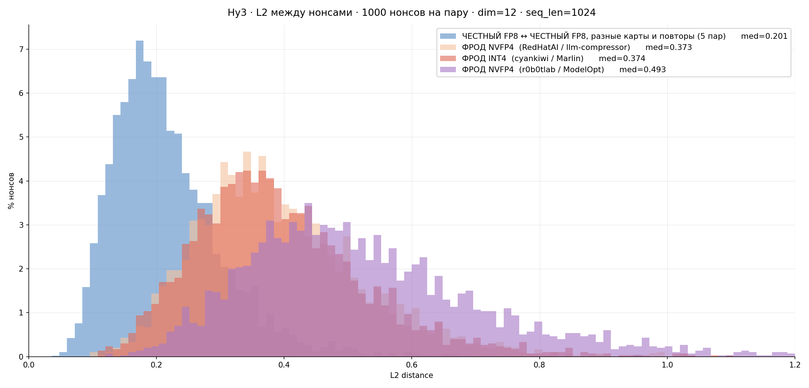

# Hy3 — campaign summary: honest baselines, three fraud checkpoints, five hosts

**Date:** 2026-08-19
**Model family:** `tencent/Hy3` — 295B total / 21B active MoE, 192 experts × top-8, 80 layers
+ 1 MTP layer, GQA 64/8 heads × 128, 256K context.
**Image:** `ghcr.io/kaitakuai/mlnode-b300-deepseek-v4-flash-0731:3.0.16-overlay-k5`
(vLLM 0.25.1) — **no port was needed**: `HYV3ForCausalLM` and `HYV3MTPModel` already ship in
0.25.1. The recipe's "≥0.26" requirement concerns optimizations (PR #47433 + HPC-Ops
kernels), not support.

This folder holds the cross-experiment view. Each individual run has its own folder with its
own artifacts and README — see the index at the bottom.

## The chart



Regenerate from the committed nonce artifacts:

```bash
python3 scripts/plot_l2_distributions.py
```

Blackwell same-machine repeats are excluded from the plot — they are a spike at exactly zero
(1000/1000 bit-identical) and only flatten the axis. Hopper repeats are **not** a spike: they
sit on the honest floor together with the cross-machine pairs, so they stay in the honest
curve.

| comparison | n | median | >0.40 |
|---|---:|---:|---:|
| honest FP8 ↔ honest FP8, different cards and repeats (5 pairs) | 5000 | **0.201** | 3.58 % |
| fraud NVFP4 (`RedHatAI` / llm-compressor) | 3000 | 0.373 | 41.77 % |
| fraud INT4 (`cyankiwi` / Marlin) | 3000 | 0.374 | 42.07 % |
| fraud NVFP4 (`r0b0tlab` / ModelOpt) | 3000 | **0.493** | 73.07 % |

For scale, two runs on **different seeds** sit at 1.406 — that is the ceiling of the metric,
left off the plot to keep the axis readable.

The two frauds built with different toolchains but the same NVFP4 scheme sit 0.12 apart,
while a completely different quantisation (INT4 W4A16, BF16 activations, MARLIN) lands on top
of one of them — distance identifies the build, not the scheme.

## Five results

### 1. Bit-exactness is architectural, and scoped to a single machine

| host | TP | arms tested | bit-identical on repeat |
|---|---:|---|---:|
| 8×H100 | 8 | FP8, INT4 | **0 %** |
| 4×H200 | 4, 2 | FP8, INT4 | **0 %** |
| 2×B300 | 2 | FP8, NVFP4 | **100 %** |
| 4×B200 | 4 | FP8, NVFP4 ×2 | **100 %** |

Seven checks, no exceptions, independent of topology (TP 1…8) and of quantisation. But the
property does **not** transfer between machines: two different Blackwell hosts sit at the
same 0.20 floor as Blackwell↔Hopper.

### 2. The honest floor is a fleet-wide constant ≈ 0.20

Every pair of distinct runs that is not bit-exact lands in **0.1977–0.2043**, across chip
(H100/H200/B200/B300), tensor-parallel width, host, datacentre and **driver version**
(0.2027 between drivers 590.48.01 and 610.57.04 — the same as a plain repeat, 0.1996).

There is no "closer" hardware pair: either the comparison is exact, or it is at 0.20. A single
network-wide gate is therefore defensible; per-pair calibration is not needed.

### 3. The fraud fingerprint belongs to the build, not the scheme

One checkpoint, five measurements across three machines, four topologies and two drivers:

| checkpoint | host / TP | L2 median vs honest |
|---|---|---:|
| `cyankiwi` INT4 | 4×H200 TP=4 (driver 610) | 0.3741 |
| `cyankiwi` INT4 | 4×H200 TP=2 (driver 590) | 0.3767 |
| `cyankiwi` INT4 | 8×H100 TP=8 | 0.3755 |
| `cyankiwi` INT4 | 8×H100 TP=4 | 0.3753 |
| `r0b0tlab` NVFP4 | 2×B300 / 4×B200 | 0.4926 / 0.4909 |

Spread **within** a checkpoint: 0.26 %. Spread **between** builds of the same NVFP4 scheme:
30 % (0.367 for `RedHatAI` against 0.491 for `r0b0tlab`). And the two frauds are further from
each other (0.52) than either is from honest.

Consequences: calibrate against the **quietest known build**; build the detector as
"distance from honest", never as "similarity to a known fraud"; distance does not identify
the quantisation either — INT4 W4A16 and NVFP4 both land at ≈0.37.

### 4. Attack economics = the honest arm's parallelism penalty minus the fraud's dequant cost

Quantisation buys no PoC throughput at equal topology. The gain comes from fitting fewer
cards and dropping tensor parallelism — and it only pays when the honest arm is forced wide.

| host | honest | fraud at its minimum topology | outcome |
|---|---|---|---:|
| 2×B300 | TP=2, 800 nonces/card | TP=1, 1183/card | **+48 %** |
| 8×H100 | TP=8, 168/card | TP=4, 184/card | **+10 %** |
| **4×H200** | TP=4, 312/card | TP=2, 272/card | **−13 %** |

**More memory per card ⇒ narrower honest topology ⇒ cheating stops paying.**

### 5. Mining-optimised fraud is a visibly worse inference provider

| host | fraud PoC gain | fraud serving, s4 (long context, 20 runners) |
|---|---:|---:|
| 2×B300 | +48 % | **+33 %** |
| 8×H100 | +10 % | −46 % |
| 4×H200 | −13 % | **−59 %**, TTFT 13.3 s vs 4.4 s |

Only on Blackwell does the fraud win on both axes. On Hopper it always pays in quality of
service — an externally observable signal that needs no cryptography.

## Honest throughput, all measured with the corrected script and a 120 s window

| topology | nonces/min | per card |
|---|---:|---:|
| 4×B200 | 1888 | 472 |
| 2×B300 | 1599 | **800** |
| 8×H100 | 1344 | 168 |
| 4×H200 | 1248 | 312 |

## MTP speculative decoding

Measured on 4×H200. It cannot influence a prefill-only proof and does not: the PoC sweep is
identical to the nonce, and the fingerprint distance (0.1993) is indistinguishable from the
honest floor (0.2025). Serving gains are real but uneven — **+20…29 % sequential, +7…9 %
under load**, at the cost of 9.4 % of the KV cache and a doubled s2 TTFT.

Allowing it is a policy decision, not a detection problem. If allowed, bake it into the
image — otherwise the gain accrues only to operators who discover it.

## Measurement caveats that shaped these numbers

- **Throughput before the fix is invalid.** The pre-fix accounting bug
  (`kaitakuai/experiments` PR #7) inflated by 0–40 %, non-uniformly; a 30 s window adds ±17 %
  because callbacks arrive in ~5 s bulks. Re-measuring 4×H200 gave **1248** against the old
  **1408** — a 12.8 % overstatement. All numbers here use the fixed script and 120 s.
- **Serving was never affected** — the redo reproduced the earlier serving figures within
  2–9 %.
- **Serving must be measured warm**, after PoC load, and `pow/stop` must precede
  compressa-perf or every request returns `503 poc_generation_active`.
- **compressa-perf 0.2.7 loses metrics** (`conn.commit()` commented out, then a crash on PDF
  generation); recompute throughput from the `measurements` table.

## Index

| folder | arm |
|---|---|
| [`hy3-fp8-4xh200`](../hy3-fp8-4xh200/) | honest FP8 + MTP variant + redo |
| [`hy3-fp8-2xb300`](../hy3-fp8-2xb300/) | honest FP8 |
| [`hy3-fp8-4xb200`](../hy3-fp8-4xb200/) | honest FP8 |
| [`hy3-fp8-8xh100`](../hy3-fp8-8xh100/) | honest FP8 |
| [`hy3-int4-cyankiwi-4xh200`](../hy3-int4-cyankiwi-4xh200/) | INT4 fraud |
| [`hy3-int4-cyankiwi-2xh200`](../hy3-int4-cyankiwi-2xh200/) | INT4 fraud, minimum topology |
| [`hy3-int4-cyankiwi-8xh100`](../hy3-int4-cyankiwi-8xh100/) | INT4 fraud |
| [`hy3-int4-cyankiwi-4xh100`](../hy3-int4-cyankiwi-4xh100/) | INT4 fraud, minimum topology |
| [`hy3-nvfp4-r0b0tlab-2xb300`](../hy3-nvfp4-r0b0tlab-2xb300/) | NVFP4 fraud |
| [`hy3-nvfp4-r0b0tlab-1xb300`](../hy3-nvfp4-r0b0tlab-1xb300/) | NVFP4 fraud, minimum topology |
| [`hy3-nvfp4-r0b0tlab-4xb200`](../hy3-nvfp4-r0b0tlab-4xb200/) | NVFP4 fraud, cross-machine control |
| [`hy3-nvfp4-redhatai-4xb200`](../hy3-nvfp4-redhatai-4xb200/) | NVFP4 fraud, second build |

## Reproducibility checklist

- [x] Chart regenerated from committed artifacts by `scripts/plot_l2_distributions.py`
- [x] Same plotting conventions as the DeepSeek-V4 experiments in this repo
- [x] Every claim here traces to a sibling folder holding its raw nonce sets
- [x] Invalid measurements named as invalid, with the magnitude of the error
- [x] No internal-tooling links, absolute paths or sibling-repo references
