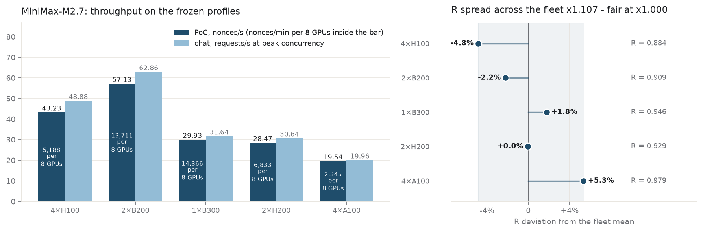
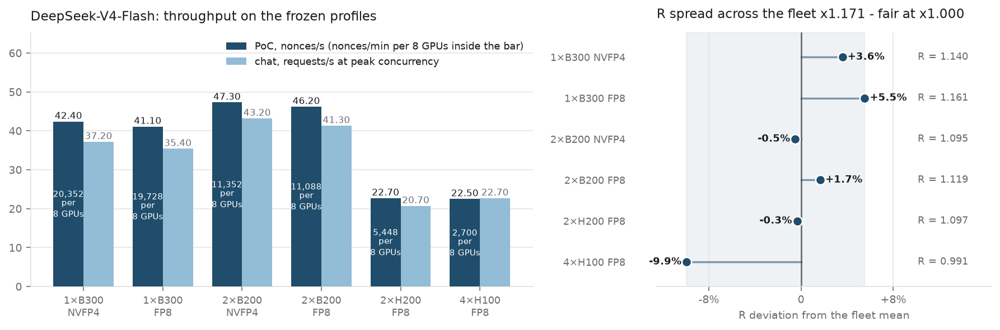
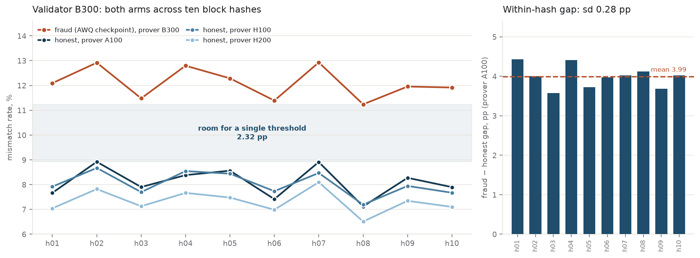
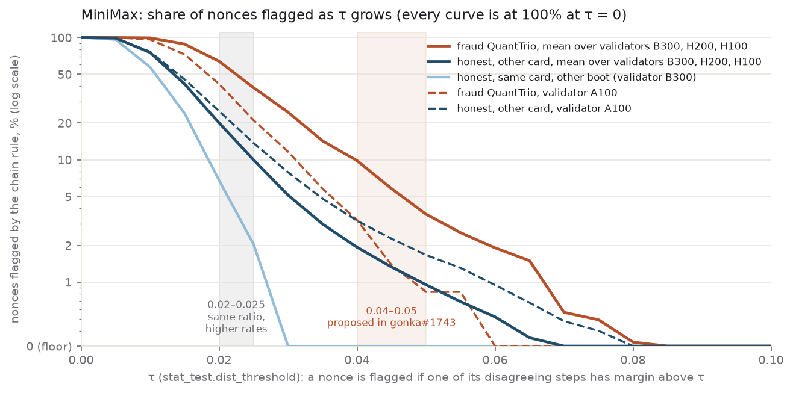
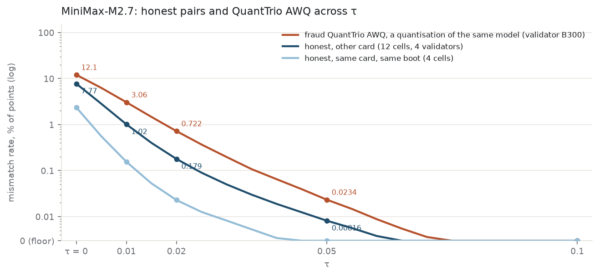
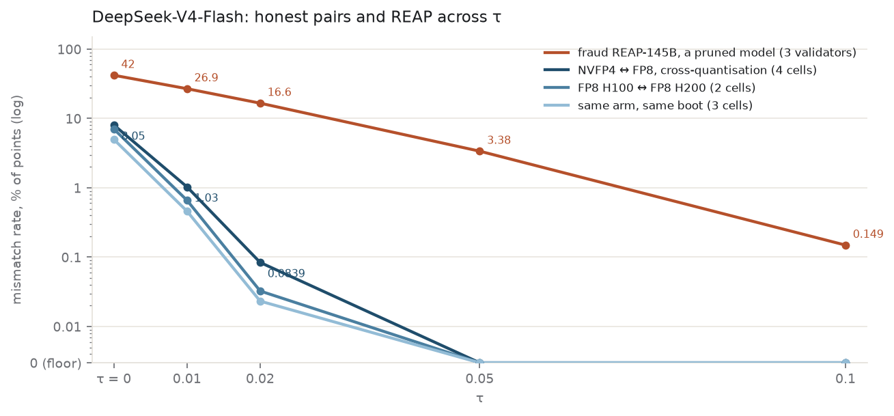

# decode-PoC on vLLM 0.25.1: frozen point for MiniMax-M2.7 and DeepSeek-V4-Flash

- **Dates:** 2026-09-09 … 2026-09-10
- **Models:** `MiniMaxAI/MiniMax-M2.7` @ `d494266a`; `deepseek-ai/DeepSeek-V4-Flash-0731` @ `7872f01b` and `MJPansa/DeepSeek-V4-Flash-0731-NVFP4` @ `64d64cd8`
- **Fraud arms:** `QuantTrio/MiniMax-M2.7-AWQ` @ `c9f2192c`; `ludo-tech/DeepSeek-V4-Flash-REAP-145B-A13B` @ `8d022f2c`
- **Hardware:** 1×B300 SXM6, 2×B200, 2×H200, 4×H100 80GB, 4×A100 SXM4
- **Stack:** `kaitakuai/vllm` @ `2ff7edd1e` (stock vLLM 0.25.1 plus 34 files) with `kaitakuai/gonka-vllm-plugins` @ `ea11ef6`, branch `poc-as-chat-vllm-0.25.1-dev`

The reruns the decode-PoC track was waiting for
([reports/2026-06-decode-poc-research-and-integration.md](../../reports/2026-06-decode-poc-research-and-integration.md),
status of 2026-09-08): both models measured on the merged `poc-as-chat` base, on one code
revision, with the same code on both sides of every validation. Throughput and the PoC/chat
ratio R per configuration, the prover × validator separability matrix, the nonce-level view of
the chain statistic, and the room a single threshold has.

Requested by [@vbgd0](https://github.com/vbgd0) for the release coefficients
([gonka-ai/gonka#1688](https://github.com/gonka-ai/gonka/issues/1688),
[#1689](https://github.com/gonka-ai/gonka/issues/1689),
[#1690](https://github.com/gonka-ai/gonka/issues/1690)).

---

## Contents

- [Code](#code) — plugin, engine, checkpoints, seeding
- [Launch settings](#launch-settings) — the eleven measured configurations and the rule behind N
- [Throughput](#throughput) — PoC and chat per configuration, nonces/min per 8 GPUs, the ratio R
- [Separability](#separability) — honest and fraud arms, every prover against every validator, the chain statistic on a τ grid, the room a single threshold has, DeepSeek on three validators
- [When these numbers apply](#when-these-numbers-apply) — conditions and what the numbers do not cover
- [Reproduce](#reproduce) — rebuilding the τ tables from the committed counters
- [Data not in this repository](#data-not-in-this-repository) — corpora and raw runs on Drive

---

## Code

| item | value |
| --- | --- |
| plugin | [kaitakuai/gonka-vllm-plugins · poc-as-chat-vllm-0.25.1-dev](https://github.com/kaitakuai/gonka-vllm-plugins/tree/poc-as-chat-vllm-0.25.1-dev) @ ea11ef6 |
| engine | [kaitakuai/vllm · poc-as-chat-vllm-0.25.1-dev](https://github.com/kaitakuai/vllm/tree/poc-as-chat-vllm-0.25.1-dev) @ 2ff7edd1e (stock 0.25.1 plus 34 files) |
| upstream | [gonka-ai/gonka-vllm-plugins#8](https://github.com/gonka-ai/gonka-vllm-plugins/pull/8) · [gonka-ai/vllm#100](https://github.com/gonka-ai/vllm/pull/100) (same trees) · chain [gonka-ai/gonka#1743](https://github.com/gonka-ai/gonka/pull/1743) |
| MiniMax | MiniMaxAI/MiniMax-M2.7 · d494266a (FP8 weights) |
| DeepSeek, FP8 | deepseek-ai/DeepSeek-V4-Flash-0731 · 7872f01b (FP8 weights with FP4 experts; "0731 FP8" in the tables) |
| DeepSeek, NVFP4 | MJPansa/DeepSeek-V4-Flash-0731-NVFP4 · 64d64cd8 ("0731 NVFP4" in the tables) |
| fraud, MiniMax | QuantTrio/MiniMax-M2.7-AWQ · c9f2192c |
| fraud, DeepSeek | ludo-tech/DeepSeek-V4-Flash-REAP-145B-A13B · 8d022f2c |
| reflection seeding | per block hash · 256 prompt tokens + 256 decode steps · 12 reflection vectors, each step stores the index of the nearest one |
| data and scripts | [poc-devkit-2026-09-09 on Google Drive](https://drive.google.com/drive/folders/1BT9c4PL2g7AnJ5zWOTK5D-9UNepZ_aFT) (4.4 GB, sha256 manifest); inventory in README.md |

## Launch settings

The eleven measured configurations. Full recipes, the sweeps behind every N and what not to do: `PROFILES.md` in the devkit.

| cards | model | TP | MoE | gpu-memory-utilization | N = max-num-seqs = capture size | max-num-batched-tokens |
| --- | --- | ---: | --- | ---: | ---: | ---: |
| 1×B300 SXM6 | MiniMax | 1 | `flashinfer_trtllm` | 0.97 | 608 | 32768 |
| 2×H200 | MiniMax | 2 | `triton` \* | 0.95 | 608 | 8192 |
| 4×H100 80GB | MiniMax | 4 | `triton` | 0.94 | 752 | 32768 |
| 4×A100 SXM4 | MiniMax | 4 | `marlin` | 0.94 | 848 | 8192 |
| 2×B200 | MiniMax | 2 | `flashinfer_trtllm` | 0.95 | 1536 | 32768 |
| 1×B300 SXM6 | DeepSeek 0731 NVFP4 | 1 | auto | 0.90 | 2048 | 32768 |
| 1×B300 SXM6 | DeepSeek 0731 FP8 | 1 | auto | 0.90 | 2048 | 32768 |
| 2×H200 | DeepSeek 0731 FP8 | 2 | auto | 0.90 | 1024 | 32768 |
| 4×H100 80GB | DeepSeek 0731 FP8 \*\* | 4 | auto | 0.90 | 640 | 16384 |
| 2×B200 | DeepSeek 0731 FP8 | 2 | auto | 0.90 | 2048 | 32768 |
| 2×B200 | DeepSeek 0731 NVFP4 | 2 | auto | 0.90 | 2048 | 32768 |

N is passed twice, as `--max-num-seqs N` and `max_cudagraph_capture_size N`: the largest multiple of 16 not above min(KV capacity in nonces, the throughput peak), where the KV capacity is the KV size printed at boot ÷ 512 tokens per nonce (MiniMax; about 800 for DeepSeek-V4, whose N is the throughput peak). PoC peaks at the capture size; a batch above it loses 20–45%. `max-num-batched-tokens` 32768 where the KV capacity at 32768 stays above N, 8192 where it does not.

\* MiniMax on H200 also needs `fuse_allreduce_rms:false`: with the allreduce+RMSNorm fusion of 0.25 on, the boot reports about 15,000 fewer KV tokens and PoC runs 3% slower.

\*\* DeepSeek on H100 was measured as max-num-seqs 640 under capture size 768; gpu-memory-utilization 0.95 livelocks the engine under PoC load.

## Throughput

All rows below were measured on the previous plugin revision; the frozen revision was re-measured on B300 with MiniMax only (When these numbers apply).

| cards · MiniMax-M2.7 | PoC, nonces/s | nonces/min per 8 GPUs | at N | chat, requests/s | at concurrency | R |
| --- | ---: | ---: | ---: | ---: | ---: | ---: |
| 4×H100 | 43.23 | 5,188 | 752 | 48.88 | 768 | 0.884 |
| 1×B300 | 29.93 | 14,366 | 608 | 31.64 | 608 | 0.946 |
| 2×H200 | 28.47 | 6,833 | 608 | 30.64 | 608 | 0.929 |
| 2×B200 | 57.13 | 13,711 | 1536 | 62.86 | 1536 | 0.909 |
| 4×A100 | 19.54 | 2,345 | 848 | 19.96 | 896 | 0.979 |

**nonces/min per 8 GPUs = nonces/s × 60 × 8 ÷ GPUs in the configuration** (8 ÷ TP instances per node, as MLNode starts them). **R = nonces/s ÷ requests/s**; the units are comparable: a nonce is 256 prompt tokens plus 256 decode steps, a chat request 256 prompt plus 256 generated. PoC runs are 3,000 nonces (9,000 for DeepSeek on B300) with ramp-up and drain included, which biases the figures down, most on 2×B200; chat is three repetitions at the peak concurrency.

**Fairness is equal R across configurations**; the absolute value depends on the work unit. The spread is **×1.107** (4×H100 to 4×A100); the chain defines no tolerance for it.



*Left: PoC and chat on the frozen settings. Right: R as a deviation from the fleet mean; fair means every point at zero.*

| cards · DeepSeek-V4-Flash | PoC, nonces/s | nonces/min per 8 GPUs | at N | chat, requests/s at peak concurrency | R |
| --- | ---: | ---: | ---: | ---: | ---: |
| 1×B300, 0731 NVFP4, TP = 1 | 42.4 | 20,352 | 2048 | 37.2 at c1024 | 1.14 |
| 1×B300, 0731 FP8, TP = 1 | 41.1 | 19,728 | 2048 | 35.4 at c1024 | 1.16 |
| 2×H200, 0731 FP8, TP = 2 | 22.7 | 5,448 | 1024 | 20.7 at c1024 | 1.10 |
| 4×H100, 0731 FP8, TP = 4 | 22.5 | 2,700 | 640 | 22.7 at c768 | 0.99 |
| 2×B200, 0731 FP8, TP = 2 | 46.2 | 11,088 | 2048 | 41.3 at c1024 | 1.12 |
| 2×B200, 0731 NVFP4, TP = 2 | 47.3 | 11,352 | 2048 | 43.2 at c1024 | 1.10 |

**DeepSeek PoC varies about 10% between boots** on the same card and code, chat more (H200 chat at c1024: 21.5 on three boots, 18.4 on the fourth); the figures are means over boots (per-boot values: FREEZE.md in the devkit). R spread ×1.17 over six configurations (4×H100 0.99 to 1×B300 on 0731 FP8 1.16). NVFP4 leads DeepSeek-V4-Flash-0731 FP8 by 3% on PoC and 5% on chat on B300, and by 2% and 5% on 2×B200; either checkpoint validates the other's artifacts (Separability).



*Left: PoC and chat on the frozen DeepSeek settings, chat at its peak concurrency. Right: R as a deviation from the DeepSeek mean; spread ×1.17.*

## Separability

### Both arms across block hashes, validator B300

Ten block hashes, h01–h10. Boots are not bit-identical (the FlashInfer autotuner selects kernels per boot), so every number is a validation cell. A corpus is 250 nonces of one block hash from one prover; a cell is one prover's ten corpora validated on one validator, given as the mean over hashes and, in brackets, the range across hashes. By points: the share of decode steps whose reflection index differs between prover and validator, counting at τ > 0 only steps whose margin (the gap between the scores of the nearest and second-nearest reflection vector) exceeds τ. By nonces: the share of nonces flagged by the chain rule below. The honest arm is MiniMax-M2.7 on each card; the fraud arm is the AWQ checkpoint (QuantTrio) generated on a B300 prover.



*Left: both arms across ten hashes on the B300 validator and the worst-case gap for one threshold. Right: the gap inside each hash for H200, the honest prover closest to the fraud arm.*

### Every prover against every validator

Mean over ten hashes at τ = 0, range across hashes in brackets. Validators in columns; the diagonal is the same boot validating its own corpora; the three starred fraud cells rest on four hashes.

| prover → validator | B300 | H200 | H100 | A100 |
| --- | ---: | ---: | ---: | ---: |
| honest B300 | 0.11 [0.00–0.45] | 7.36 [6.37–7.89] | 7.92 [6.99–8.42] | 8.14 [7.15–8.74] |
| honest H200 | 7.32 [6.51–8.10] | 0.28 [0.03–0.61] | 7.44 [6.65–8.15] | 7.70 [6.91–8.45] |
| honest H100 | 8.03 [7.19–8.67] | 7.60 [6.68–8.30] | 6.57 [5.64–7.10] | 8.00 [6.96–8.49] |
| honest A100 | 8.11 [7.12–8.92] | 7.82 [6.80–8.65] | 7.80 [6.83–8.62] | 2.52 [1.96–2.89] |
| fraud QuantTrio | 12.10 [11.24–12.93] | 12.23 [11.27–13.05] \* | 12.11 [11.17–12.77] \* | 10.16 [9.51–10.77] \* |

\* On H200, H100 and A100 the fraud cell uses the nonces without NaN steps (hashes h01–h04, 616 nonces) of a fraud corpus whose later hashes decayed into NaN chains (FREEZE.md in the devkit); the B300 cell uses the corpus generated with one boot per hash. Where both exist they agree (B300: 12.10 against 12.26).

**The fraud level is set by the validator** (12.1–12.2% on B300, H200 and H100, same-card or not; 10.2% on A100); the honest other-card level is 6.4–8.9% everywhere, A100 as a prover included, and a same card after a reboot on a different plugin build sits at 6.31%. Rates drift 15–25% across block hashes but the arms drift together (correlation +0.90 … +0.93), so the gap inside a hash holds at 4.0–4.8 pp ± 0.3 on the B300 validator. The MiniMax same-boot cell on 4×H100 (6.57%) sits at the other-card level and is not explained. On the A100 validator the margin is 0.8 pp by points and zero by nonces at τ ≥ 0.04: sm80 nodes should not validate at the proposed thresholds.

### What the chain statistic sees

The decode validation is one trial per nonce: a nonce diverges if the largest margin among its disagreeing steps exceeds τ (`stat_test.dist_threshold`), then the binomial test with `p_mismatch` decides. The table gives the share of nonces with at least one disagreement, mean over hashes.

| validator | prover set | τ = 0.02 | 0.025 | 0.04 | 0.05 |
| --- | --- | ---: | ---: | ---: | ---: |
| B300 | honest, same card, other boot | 7% | 2% | 0% | 0% |
| B300 · H200 · H100 | honest, other card | 14–27% | 5–16% | 1–5% | 0–2% |
| B300 · H200 · H100 | fraud QuantTrio | 63–66% | 37–41% | 9–11% | 3.5–3.7% |
| A100 | honest, other card | 22–27% | 12–16% | 2–5% | 1–3% |
| A100 | fraud QuantTrio | 42% | 21% | 3% | 1% |



*Share of nonces flagged as τ grows, log scale (100% at τ = 0; zero on the axis floor). Solid: means over validators B300, H200, H100; dashed: A100. Bands: 0.04–0.05 proposed in gonka#1743; 0.02–0.025, the same ratio on rates a binomial test resolves with fewer nonces.*

### Room for one threshold per model

> **Estimate, needs confirmation.** The fraud minimum on the H200, H100 and A100 validators rests
> on the four block hashes without NaN chains; a fraud corpus complete on all ten would confirm
> these margins.

The chain sets one threshold per model. By points at τ = 0 it has to pass between the highest honest hash mean and the lowest fraud hash mean on every validator:

| validator | highest honest | lowest fraud | worst-case gap | ratio |
| --- | ---: | ---: | ---: | ---: |
| B300 | 8.92% (prover A100, h02) | 11.24% (h08) | 2.32 pp | 1.260 |
| H200 | 8.65% (prover A100, h02) | 11.27% (h03) \* | 2.61 pp | 1.302 |
| H100 | 8.62% (prover A100, h02) | 11.17% (h03) \* | 2.55 pp | 1.296 |
| A100 | 8.74% (prover B300, h07) | 9.51% (h03) \* | 0.77 pp | 1.088 |

\* Lowest fraud hash among the four hashes without NaN chains (h01–h04) on this validator; the gap is an upper bound.

Across the four validators the threshold has to sit between 8.92% and 9.51%, 0.6 pp; without sm80 validators, between 8.92% and 11.17%, 2.25 pp, an upper bound where the fraud minimum rests on four hashes. By nonces the fraud flags three to five times as many nonces as honest other-card provers at every τ from 0.02 to 0.05 (means over provers; per validator: tau_matrix.md in the devkit). Against the worst single honest cell the ratio is 2.4 at 0.02, 2.7 at 0.025, 3.1 at 0.04 and 1.8 at 0.05 (fraud 3.5% against 2% for H100 corpora on the B300 validator). The 0.04–0.05 proposed on the chain (gonka#1743) separates this fraud on rates of a few per cent, where p_mismatch and the number of nonces per validation set the power of the binomial test; 0.02–0.025 gives the same ratio on rates the test resolves with fewer nonces.

### DeepSeek-V4-Flash, three validators

FP8 is `deepseek-ai/DeepSeek-V4-Flash-0731`, NVFP4 is `MJPansa/DeepSeek-V4-Flash-0731-NVFP4`. Corpora of 250 nonces × 10 hashes; rates are per cent of points at τ = 0 / 0.02 / 0.05 / 0.1.

| prover → validator | NVFP4 @ B300 | FP8 @ H200 | FP8 @ H100 |
| --- | ---: | ---: | ---: |
| NVFP4 B300 | 1.49 / 0.018 / 0 / 0 (same boot) | 8.08 / 0.087 / 0 / 0 | 8.08 / 0.089 / 0 / 0 |
| FP8 H200 | 8.02 / 0.082 / 0.0002 / 0 | 6.74 / 0.027 / 0 / 0 (same boot) | 7.04 / 0.032 / 0 / 0 |
| FP8 H100 | 8.02 / 0.078 / 0 / 0 | 7.05 / 0.033 / 0 / 0 | 6.74 / 0.025 / 0 / 0 (same boot, 600 nonces) |
| fraud REAP-145B | 42.00 / 16.62 / 3.38 / 0.149 | 42.02 / 16.64 / 3.38 / 0.149 | 42.02 / 16.60 / 3.38 / 0.149 |

The two Hopper FP8 arms are indistinguishable (within 0.3 pp of a same-boot cell). NVFP4 against FP8: 8.0–8.1% at τ = 0, 0 at 0.05 on every pair. REAP: 3.4% at τ = 0.05 and 0.15% at 0.1, identical to 0.02 pp across validators. By points at τ = 0.05 every honest pair is at zero and REAP at 3.4%, so any threshold between them separates this fraud; the chain's nonce-level rule was not evaluated for DeepSeek (per-nonce counts were not kept). REAP, a pruned model, is a cruder fraud than QuantTrio, a quantisation of the same model: the 3–5× ratio of the MiniMax section is against the harder kind, and no quantisation fraud was measured for DeepSeek.





*Mismatch rate by points, log scale; zero sits on the axis floor. MiniMax: the full τ grid; DeepSeek: the six stored points, joined. Honest pairs coincide across models (8% at τ = 0, 1% at 0.01, near zero at 0.05). REAP falls ten times slower than the honest pairs; QuantTrio falls at the honest rate, a constant ratio of 3–4.*

## When these numbers apply

- **Same code on both sides, autotuner on, prefix caching off, speculative decoding off, the profiles above.** The throughput tables (2×B200 included) are from the previous plugin revision. The frozen revision was re-measured on B300 with MiniMax only: PoC 29.0 nonces/s against 30.2 for the previous revision in the same session, one run each (the table row, 29.9, is another run of the previous revision); chat 31.6–31.9 requests/s at c608, unchanged, so R holds. No other card or model.

- **Same-boot self-validation cells are not network quantities.** Two honest nodes see the other-card level: 6.4–8.9% at τ = 0 for MiniMax, 7.0–8.1% for DeepSeek (2.0% on the same card after a reboot, NVFP4 on B300).

- **2×B200 has throughput only.** No validation cell was taken on it, as prover or validator.

---

## Reproduce

Every separability and τ table in this report is rebuilt from the counters in `artifacts/`,
without a GPU:

```bash
python3 scripts/tau_table.py > artifacts/tau_matrix.md
```

`artifacts/validations/minimax/validator_<card>/*.npz` holds, per cell and block hash, the
number of disagreeing steps of each of the 250 nonces on a τ grid of 0 … 0.2 in steps of 0.005,
plus the compared-step count. `artifacts/validations/deepseek/` holds the τ-grid summaries and
margins of the twelve DeepSeek cells. `artifacts/fig_data_matrix.json` and
`artifacts/fig_data_tau.json` are the per-hash arrays behind the figures;
`artifacts/provenance/` holds the boot records (KV size, checkpoint revision, MoE backend, GPU,
driver) of every generation and validation run.

## Data not in this repository

Corpora with per-step vectors (4.2 GB) and the raw throughput runs (182 MB) are too large for
the tree. They are in the `poc-devkit-2026-09-09` bundle on Google Drive together with the
generation and validation kits, the run scripts, the launch profiles (`PROFILES.md`) and the
full freeze description (`FREEZE.md`):
<https://drive.google.com/drive/folders/1BT9c4PL2g7AnJ5zWOTK5D-9UNepZ_aFT>

The bundle carries a sha256 manifest; the same report is in it as `docs/decode-poc-freeze-0909.md`.
