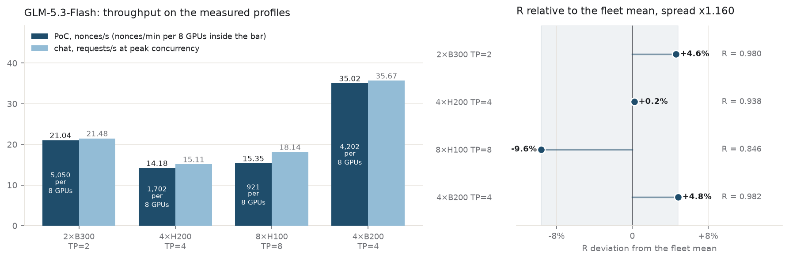
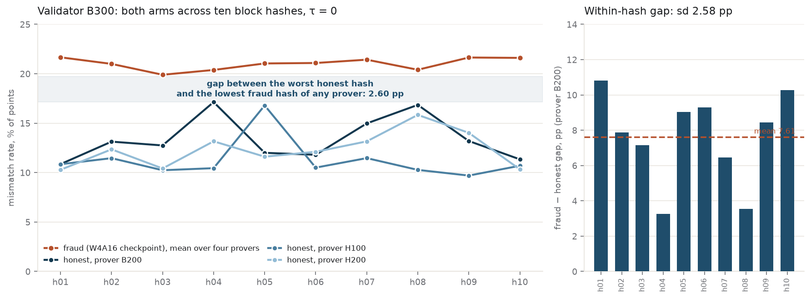
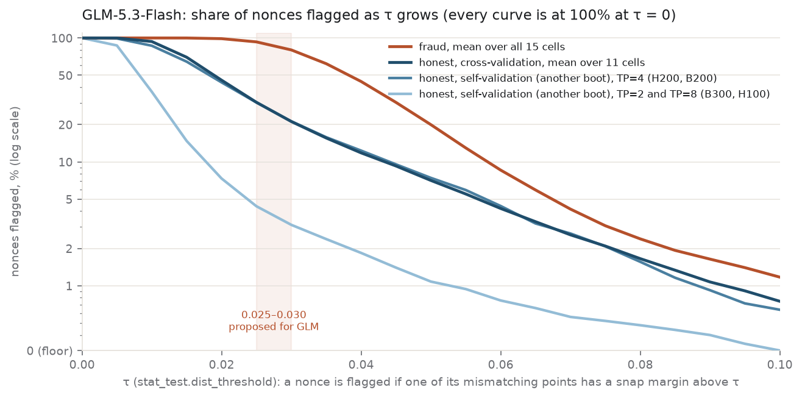
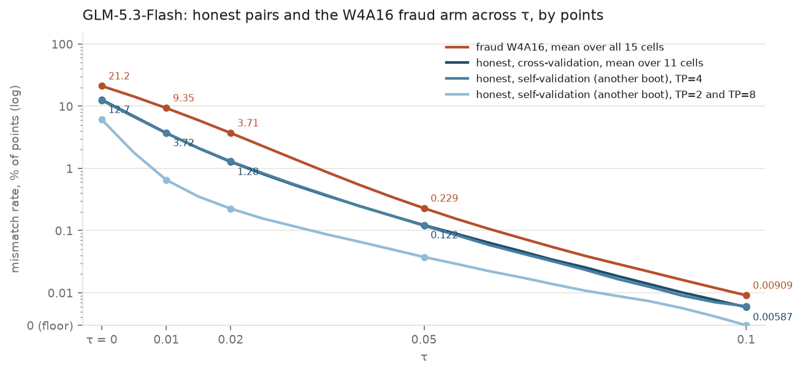

# decode-PoC on vLLM 0.28.1: measured state for GLM-5.3-Flash

- **Dates:** 2026-09-13 … 2026-09-15
- **Model:** `zai-org/GLM-5.3-Flash` @ `eb9eb208` (FP8 weights)
- **Fraud arm:** `wtdcode/GLM-5.3-Flash-AWQ-W4A16` @ `abd7b077` (INT4 on the routed experts only)
- **Hardware:** 2×B300 SXM6, 4×H200, 8×H100 80GB, 4×B200
- **Stack:** `vllm/vllm-openai:glm53-flash` (upstream vLLM `385dce36b`, 0.28.1rc1) with `kaitakuai/vllm` @ `316e2779` (21 files) and `kaitakuai/gonka-vllm-plugins` @ `7617c0d`, branches `poc-as-chat-vllm-0.28.1-glm-dev` / `poc-as-chat-vllm-0.28.0-glm-dev`

The decode-PoC scheme measured on GLM-5.3-Flash, the model that took Kimi's place on the
decode track ([gonka-ai/gonka#1690](https://github.com/gonka-ai/gonka/issues/1690), parent
[#1135](https://github.com/gonka-ai/gonka/issues/1135)): four GPU configurations on one set of
code revisions, with the same code on both sides of every validation. Throughput and the
PoC/chat ratio R per configuration, the prover × validator separability matrix, the nonce-level
view of the chain statistic, and the room a single threshold has. Requested by
[@vbgd0](https://github.com/vbgd0) for the MLNode image of this model on vLLM 0.28.

---

## Contents

- [Code](#code) — plugin, engine, checkpoints, seeding
- [Launch settings](#launch-settings) — the four measured configurations and the rule behind N
- [Throughput](#throughput) — PoC and chat per configuration, nonces/min per 8 GPUs, the ratio R
- [Separability](#separability) — honest and fraud arms, every prover against every validator, the chain statistic on a τ grid, the room a single threshold has
- [Reproduce](#reproduce) — rebuilding the τ tables from the committed counters
- [Data not in this repository](#data-not-in-this-repository) — corpora and raw runs on Drive

---

## Code

| item | value |
| --- | --- |
| plugin | [kaitakuai/gonka-vllm-plugins · poc-as-chat-vllm-0.28.0-glm-dev](https://github.com/kaitakuai/gonka-vllm-plugins/tree/poc-as-chat-vllm-0.28.0-glm-dev) @ 7617c0d |
| engine | [kaitakuai/vllm · poc-as-chat-vllm-0.28.1-glm-dev](https://github.com/kaitakuai/vllm/tree/poc-as-chat-vllm-0.28.1-glm-dev) @ 316e2779 (upstream 0.28.1rc1 plus 21 files) |
| runtime | vllm/vllm-openai:glm53-flash (the vLLM image built for this model); the 21 files copied over site-packages, the plugin installed on top |
| GLM-5.3-Flash | zai-org/GLM-5.3-Flash · eb9eb208 (FP8 weights) |
| fraud, GLM | wtdcode/GLM-5.3-Flash-AWQ-W4A16 · abd7b077 (INT4 on the routed experts only) |
| reflection seeding | per block hash · 256 prompt tokens + 256 decode steps · 16 reflection vectors, each point stores the index of the nearest one · all 42 MoE routers seeded |
| data and scripts | [poc-devkit-glm-2026-09-15 on Google Drive](https://drive.google.com/drive/folders/1ih72kHEazVBbH6MAd-hV0_LiZ6Bap98v) (3.4 GB, sha256 manifest); inventory in README.md |

## Launch settings

The four measured configurations. Full recipes, the sweeps behind every N and what not to do: `PROFILES.md` in the devkit.

| cards | TP | KV cache | MoE | gpu-memory-utilization | N = max-num-seqs = capture size | max-num-batched-tokens |
| --- | ---: | --- | --- | ---: | ---: | ---: |
| 2×B300 SXM6 | 2 | bf16 | `flashinfer_trtllm` | 0.95 | 1024 \* | 32768 |
| 4×H200 | 4 | bf16 | `triton` | 0.90 | 256 | not set \*\*\* |
| 8×H100 80GB | 8 | fp8 | `marlin` | 0.95 | 512 \*\* | 8192 |
| 4×B200 | 4 | fp8 | `flashinfer_trtllm` | 0.90 | 1024 | 32768 |

N is passed twice, as `--max-num-seqs N` and `max_cudagraph_capture_size N`; PoC artifacts are requested with `batch_size 0`, so the engine schedules the batch. PoC peaks at N 256 on Hopper and rises to N 1024 on Blackwell. The MoE kernel and the KV cache type do not carry over between cards: the engine default kernel is fastest on B300, H200 and B200, `marlin` on H100; fp8 KV is 30–34% faster than bf16 on H100 and within boot noise elsewhere. `max-num-batched-tokens` stays below the prefill step that crashes the engine (32768 tokens on 8×H100, 65536 on 2×B300). Common flags, the sweeps behind every setting and what not to do: `PROFILES.md`.

\* 512 is within boot noise of 1024; the throughput row was measured at 1024.
\*\* chosen for chat (+7% against N 256, PoC within noise).
\*\*\* engine default (8192 in these boots).

## Throughput

| cards · GLM-5.3-Flash | PoC, nonces/s | nonces/min per 8 GPUs | at N | chat, requests/s | at concurrency | R |
| --- | ---: | ---: | ---: | ---: | ---: | ---: |
| 2×B300 | 21.04 | 5,050 | 1024 | 21.48 | 512 | 0.980 |
| 4×H200 | 14.18 | 1,702 | 256 | 15.11 | 256 | 0.938 |
| 8×H100 | 15.35 | 921 | 512 | 18.14 | 512 | 0.846 |
| 4×B200 | 35.02 | 4,202 | 1024 | 35.67 | 1024 | 0.982 |

**nonces/min per 8 GPUs = nonces/s × 60 × 8 ÷ GPUs in the configuration** (8 ÷ TP instances per node, as MLNode starts them). **R = nonces/s ÷ requests/s**; the units are comparable: a nonce is 256 prompt tokens plus 256 decode steps, a chat request 256 prompt plus 256 generated. Each row is one boot: PoC first (2,560 nonces on B300, 5,120 on B200, 1,280 on H200 and H100, after a 128-nonce warm-up, ramp-up and drain included), then chat with three repetitions at each concurrency; the row gives the peak over concurrencies.

**Fairness is equal R across configurations**; the absolute value depends on the work unit. The spread is **×1.160** (8×H100 0.846 to 4×B200 0.982); the chain defines no tolerance for it.



*Left: PoC and chat on the measured settings. Right: R as a deviation from the fleet mean; fair means every point at zero.*

## Separability

### Both arms across block hashes, validator B300

Ten block hashes, h01–h10. No GLM nonce reproduces on another boot without a mismatching point, so every number is a validation cell. A corpus is 250 nonces of one block hash from one prover; a cell is one prover's ten corpora validated on one validator, given as the mean over hashes and, in brackets, the range across hashes. A point is one of the 257 positions of a nonce's chain compared between prover and validator by its reflection index. By points: the share of points whose index differs, counting at τ > 0 only points whose margin (the gap between the scores of the nearest and second-nearest reflection vector) exceeds τ. By nonces: the share of nonces flagged by the chain statistic below. The honest arm is GLM-5.3-Flash on each card; the fraud arm is the W4A16 checkpoint, its corpora generated on each prover with the same settings.



*Left: both arms across ten hashes on the B300 validator and the worst-case gap for one threshold. Right: the gap inside each hash for B200, the honest prover closest to the fraud arm.*

### Every prover against every validator

Mean over ten hashes at τ = 0, range across hashes in brackets. Validators in columns; the starred cells are the same card validating its own corpora from another boot (H200: the validator on a second instance of the same node). The fraud row pools the provers validated on each validator. TP: B300 2, H200 4, H100 8, B200 4.

| prover → validator | B300 | H200 | H100 | B200 |
| --- | ---: | ---: | ---: | ---: |
| honest B300 | 5.08 [4.72–5.57] \* | 12.53 [10.26–16.31] | 11.52 [9.71–16.63] | 13.62 [11.25–17.79] |
| honest H200 | 12.33 [10.28–15.84] | 12.61 [8.97–16.33] \* | 12.36 [9.63–14.80] | 13.53 [10.91–15.50] |
| honest H100 | 11.24 [9.70–16.80] | 12.42 [9.52–15.73] | 7.06 [6.22–8.23] \* | 13.25 [10.85–15.94] |
| honest B200 | 13.40 [10.85–17.13] | 13.52 [10.51–15.57] | — \*\* | 12.25 [9.31–14.98] \* |
| fraud W4A16 | 21.01 [19.74–22.05] | 21.13 [19.72–22.35] | 20.77 [18.92–22.91] \*\* | 21.60 [20.54–22.67] |

\*\* B200 corpora were not validated on H100; the H100 fraud cell pools three provers, the other fraud cells four.

### What the chain statistic sees

The decode validation is one trial per nonce: a nonce diverges if the largest margin among its disagreeing steps exceeds τ (`stat_test.dist_threshold`), then the binomial test with `p_mismatch` decides. The table gives the share of nonces with at least one disagreement, mean over hashes; ranges over the cells of the row.

| validator | prover set | τ = 0.02 | 0.025 | 0.03 | 0.04 | 0.05 |
| --- | --- | ---: | ---: | ---: | ---: | ---: |
| B300 · H100 | honest, same card, other boot | 5–10% | 2–6% | 2–5% | 1–3% | 0–2% |
| H200 · B200 | honest, same card, other boot | 43–45% | 29–31% | 20–23% | 11–13% | 7–8% |
| all four | honest, other card (11 cells) | 36–53% | 22–35% | 14–25% | 8–14% | 4–9% |
| all four | fraud W4A16 (15 cells) | 98–99% | 91–94% | 77–82% | 41–48% | 18–23% |

Every honest row is at 100% at τ = 0: no GLM nonce reproduces without a mismatching point, even on the same card, so τ = 0 carries no information for this model.



*Share of nonces flagged as τ grows, log scale (100% at τ = 0; zero on the axis floor). Lines: means over cells — fraud (15 cells), honest other card (11), honest same card after another boot at TP=4 and at TP=2 / TP=8. Band: 0.025–0.030, proposed for GLM.*

### Room for one threshold per model

> **Estimate, needs confirmation.** Every corpus and validation was taken at N 256 while the
> profiles run N 512–1024; cells at the profile N were not measured. The H100 fraud cell rests
> on three provers.

The chain sets one threshold per model. By points at τ = 0 it has to pass between the highest honest hash mean and the lowest fraud hash mean on every validator, over every prover validated there (same card after another boot included):

| validator | highest honest | lowest fraud | worst-case gap | ratio |
| --- | ---: | ---: | ---: | ---: |
| B300 | 17.13% (prover B200, h04) | 19.74% (prover B300, h03) | 2.60 pp | 1.152 |
| H200 | 16.33% (prover H200, other boot, h09) | 19.72% (prover B300, h03) | 3.40 pp | 1.208 |
| H100 | 16.63% (prover B300, h05) | 18.92% (prover B300, h05) \* | 2.29 pp | 1.138 |
| B200 | 17.79% (prover B300, h08) | 20.54% (prover B300, h03) | 2.75 pp | 1.154 |

\* Lowest among the three provers validated on H100.

Across the four validators the threshold by points has to sit between 17.79% and 18.92%, 1.13 pp; the ratio of the lowest fraud hash to the highest honest hash is 1.14–1.21 per validator. By nonces the fraud flags 2.4–4.3 times as many nonces as honest other-card provers at every τ from 0.02 to 0.05 (means over cells); against the worst single honest hash the ratio is 1.3 at 0.02, 1.4 at 0.025, 1.6 at 0.03, 1.2 at 0.04 and 0.5 at 0.05. One (τ, `p_mismatch`) pair for the fleet, chosen so that the worst honest hash of all 15 cells passes a 200-nonce partition with probability 99%: τ 0.025 → `p_mismatch` 0.605, τ 0.030 → 0.450, both with full power against the lowest fraud hash; power falls to 80% at τ 0.035, 25% at 0.040 and 0 at 0.050 (`scripts/tau_fleet.py`). `p_mismatch` here equals the observed maximum with no margin. The chain sets τ and `p_mismatch` per model; this pair is GLM's own.



*Mismatch rate by points, log scale; zero sits on the axis floor. The two TP=4 same-card curves coincide with the other-card curve; the TP=8 same-card curve sits two to five times below it, the TP=2 curve ten to twenty times below at τ ≥ 0.02.*

---

## Reproduce

Every separability and τ table in this report is rebuilt from the counters in `artifacts/`,
without a GPU:

```bash
python3 scripts/tau_table.py > artifacts/tau_matrix.md
python3 scripts/tau_fleet.py --part=200 --alpha=0.01 $(for d in artifacts/validations/glm/validator_*/prover_*; do echo "$(basename $(dirname $d))_$(basename $d)=$d"; done)
```

`artifacts/validations/glm/validator_<card>/prover_<card>/npz_<honest|fraud>_hNN_v200.npz`
holds, per cell and block hash, the number of mismatching points of each of the 250 nonces on a
τ grid of 0 … 0.1 in steps of 0.005 and 0.11 … 0.5 in steps of 0.02, plus the points compared per
nonce (257). `artifacts/provenance/` holds the boot records of every corpus and validation run
(checkpoint revision and sha, KV capacity in tokens, N, capture size, MoE backend, GPU, driver),
named `<validator>__<prover>__kv_<tag>.json`, and the acceptance-check records
`gate__<card>__kv_s1.json`. `artifacts/perf/<card>/` holds the throughput sweeps
(`perf_points.tsv`: one line per boot) and the chat sweeps (`r_chat_sweep_*.json`) behind the
throughput table; the H200 sweep is the plan log `plan_s23_s24.log` and `perf_points_kv.tsv`.

## Data not in this repository

Corpora with per-step vectors (3.4 GB) and the boot and server logs of the throughput runs are
too large for the tree. They are in the `poc-devkit-glm-2026-09-15` bundle on Google Drive
together with the measurement kit, the run scripts, the launch profiles (`PROFILES.md`) and the
full description of the measured state (`FREEZE.md`):
<https://drive.google.com/drive/folders/1ih72kHEazVBbH6MAd-hV0_LiZ6Bap98v>

The bundle carries a sha256 manifest; the same report is in it as `docs/decode-poc-glm-0915.html`.
