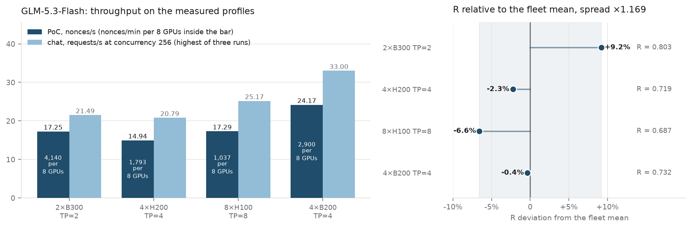
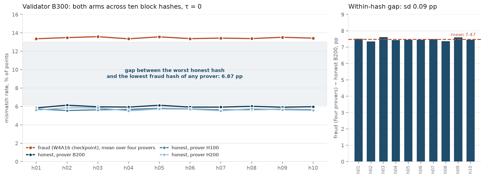
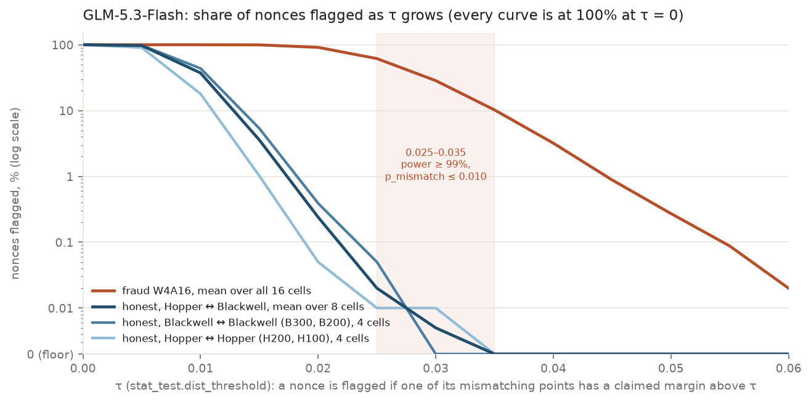
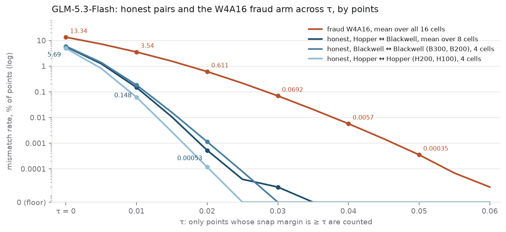

# decode-PoC on vLLM 0.30.0: measured state for GLM-5.3-Flash

- **Date:** 2026-10-02
- **Model:** `zai-org/GLM-5.3-Flash` @ `04c4e9e9` (FP8 weights)
- **Fraud arm:** `wtdcode/GLM-5.3-Flash-AWQ-W4A16` @ `abd7b077` (INT4 on the routed experts only)
- **Hardware:** 2×B300 SXM6, 4×H200, 8×H100 80GB, 4×B200
- **Stack:** `ghcr.io/gonka-ai/mlnode@sha256:dbf2a7075b30…` (the MLNode release image: vLLM 0.30.0, V1 runner) with `gonka-ai/vllm` @ `befecf60` and `gonka-ai/gonka-vllm-plugins` @ `9c031d1c` (`gonka-poc` 0.2.0), branches `release/v0.30-decode-int` / `decode/vlm030`

The decode-PoC scheme measured on GLM-5.3-Flash: four GPU configurations on the MLNode release
image, with the same code on both sides of every validation. Throughput and the PoC/chat ratio R per
configuration, the prover × validator separability matrix, the nonce-level view of the chain
statistic, and the room a single threshold has.

---

## Contents

- [Code](#code) — plugin, engine, image, checkpoints, seeding
- [Launch settings](#launch-settings) — the four measured configurations
- [Throughput](#throughput) — PoC and chat per configuration, nonces/min per 8 GPUs, the ratio R
- [Separability](#separability) — honest and fraud arms, every prover against every validator, the chain statistic on a τ grid, the room a single threshold has
- [Reproduce](#reproduce) — rebuilding the τ tables from the counters in this folder
- [Data not in this repository](#data-not-in-this-repository) — corpora, validator vectors and raw runs on Drive

---

## Code

| item | value |
| --- | --- |
| plugin | [gonka-ai/gonka-vllm-plugins · decode/vlm030](https://github.com/gonka-ai/gonka-vllm-plugins/tree/decode/vlm030) @ 9c031d1c (`gonka-poc` 0.2.0, as installed in the image) |
| engine | [gonka-ai/vllm · release/v0.30-decode-int](https://github.com/gonka-ai/vllm/tree/release/v0.30-decode-int) @ befecf60 (vLLM 0.30.0, V1 runner) |
| runtime | ghcr.io/gonka-ai/mlnode@sha256:dbf2a7075b30… (the MLNode release image, tag decode-poc-int-0.2.16-vllm-0.30-7b0770d3-befecf6); vLLM started through the MLNode API `inference/up` with the launch arguments as `additional_args` |
| GLM-5.3-Flash | zai-org/GLM-5.3-Flash · 04c4e9e9 (FP8 weights) |
| fraud, GLM | wtdcode/GLM-5.3-Flash-AWQ-W4A16 · abd7b077 (INT4 on the routed experts only) |
| reflection seeding | per block hash · 256 prompt tokens + 256 decode steps · 16 reflection vectors, each point stores the index of the nearest one · all 42 MoE routers seeded |
| data and scripts | [poc-devkit-glm-2026-10-02 on Google Drive](https://drive.google.com/drive/folders/1Oaf6U2_AS9Sa6K2mi7FngveevvspDLc8) (19.7 GB, sha256 manifest); inventory in README.md |

## Launch settings

The four measured configurations. Full profiles: `PROFILES.md` in the devkit.

| cards | TP | KV cache | MoE (engine choice) | gpu-memory-utilization | N = max-num-seqs | max-num-batched-tokens |
| --- | ---: | --- | --- | ---: | ---: | ---: |
| 2×B300 SXM6 | 2 | fp8 | `flashinfer_trtllm` | 0.90 | 256 | 32768 |
| 4×H200 | 4 | fp8 | `triton` | 0.90 | 256 | 16384 |
| 8×H100 80GB \* | 8 | fp8 | `triton` | 0.95 | 256 | 8192 |
| 4×B200 \* | 4 | fp8 | `flashinfer_trtllm` | 0.90 | 256 | 32768 |

All four run one argument set: `--max-model-len 400000 --kv-cache-dtype fp8 --block-size 2304 --no-enable-prefix-caching --no-enable-flashinfer-autotune --kda-prefill-backend triton --attention-config '{"sparse_mla_force_mqa": true}' --language-model-only`, plus the tool and reasoning parsers (`PROFILES.md`). The MoE column is the backend the engine chose; no kernel was set. The CUDA graph capture size is the engine default, 512. Corpora and throughput are requested with `batch_size 0`, so the engine schedules the batch; a validation request carries one partition of 200 nonces, or the tail of 50. H200, H100 and B200 ran with `NCCL_NVLS_ENABLE=0 NCCL_CUMEM_ENABLE=0`.

\* with `--disable-custom-all-reduce`.

## Throughput

| cards · GLM-5.3-Flash | PoC, nonces/s | nonces/min per 8 GPUs | at N | chat, requests/s | at concurrency | R |
| --- | ---: | ---: | ---: | ---: | ---: | ---: |
| 2×B300 | 17.25 | 4,140 | 256 | 21.49 | 256 | 0.803 |
| 4×H200 | 14.94 | 1,793 | 256 | 20.79 | 256 | 0.719 |
| 8×H100 | 17.29 | 1,037 | 256 | 25.17 | 256 | 0.687 |
| 4×B200 | 24.17 | 2,900 | 256 | 33.00 | 256 | 0.732 |

**nonces/min per 8 GPUs = nonces/s × 60 × 8 ÷ GPUs in the configuration** (8 ÷ TP instances per node, as MLNode starts them). **R = nonces/s ÷ requests/s**; the units are comparable: a nonce is 256 prompt tokens plus 256 decode steps, a chat request 256 prompt plus 256 generated.

Each row is one boot with no other engine of the campaign on its host: PoC first, 2,560 nonces after a 128-nonce warm-up, ramp-up and drain included; then chat, three runs of 768 requests at concurrency 256 (`vllm bench serve`, random 256/256, `--ignore-eos`). The row gives the highest run.

**Fairness is equal R across configurations**; the absolute value depends on the work unit. The spread is **×1.169** (8×H100 0.687 to 2×B300 0.803); the chain defines no tolerance for it.



*Left: PoC and chat on the measured settings (chat: the highest of three runs). Right: R as a deviation from the fleet mean; fair means every configuration at zero.*

## Separability

### Both arms across block hashes, validator B300

Ten block hashes, h01–h10. No GLM nonce reproduces on another boot without a mismatching point, so every number is a validation cell. A corpus is 250 nonces of one block hash from one prover; a cell is one prover's corpora (ten per arm) validated on one validator, given as the mean over hashes and, in brackets, the range across hashes. A point is one of the 257 positions of a nonce's chain, compared between prover and validator by its reflection index.

The snap margin of a point is the gap between the scores of the nearest and second-nearest reflection vector; the claimed margin is the score of the nearest vector minus the score of the vector the prover claimed (`sphere.claimed_margin` in the plugin; its largest value per nonce is `mismatch_margin_max`).

By points: the share of points whose index differs, counting at τ > 0 only points whose snap margin is at least τ. By nonces: the share of nonces flagged by the chain statistic below. The fraud arm is the W4A16 checkpoint; its corpora were generated on each prover with the same settings, its MoE layers on the `marlin` WNA16 kernel.



*Left: honest provers H200, H100 and B200 and the fraud mean over four provers on validator B300; the B300 self-validation cell (5.85–6.01%) lies within the honest range and is not drawn. Shaded: from the highest honest hash to the lowest fraud hash of any prover. Right: per hash, the fraud mean over four provers minus honest prover B200.*

### Every prover against every validator

Mean over ten hashes at τ = 0, range across hashes in brackets. Validators in columns; the starred cells are self-validation: the same configuration validating its own corpora on another boot (B300 and H200: other GPUs of the same host; H100 and B200: the same GPUs after the generation boot stopped). The fraud row pools the four provers validated on each validator. TP: B300 2, H200 4, H100 8, B200 4.

| prover → validator | B300 | H200 | H100 | B200 |
| --- | ---: | ---: | ---: | ---: |
| honest B300 | 5.93 [5.85–6.01] \* | 5.70 [5.54–5.84] | 5.75 [5.65–5.85] | 5.99 [5.83–6.18] |
| honest H200 | 5.67 [5.52–5.85] | 4.90 [4.77–5.04] \* | 4.96 [4.85–5.11] | 5.65 [5.51–5.74] |
| honest H100 | 5.67 [5.56–5.80] | 4.95 [4.82–5.08] | 4.82 [4.70–4.88] \* | 5.69 [5.58–5.86] |
| honest B200 | 5.97 [5.85–6.13] | 5.70 [5.62–5.83] | 5.66 [5.49–5.76] | 5.94 [5.86–6.02] \* |
| fraud W4A16 | 13.45 [13.00–13.70] | 13.25 [12.79–13.48] | 13.25 [12.77–13.56] | 13.43 [12.99–13.66] |

### What the chain statistic sees

The decode validation is one trial per nonce. In the image's plugin a nonce is flagged when it has at least one mismatching point and the largest claimed margin among its mismatching points exceeds τ (`stat_test.dist_threshold`); then the binomial test with `p_mismatch` decides on the partition. The table gives the share of flagged nonces, mean over hashes; ranges over the cells of the row.

| validator | prover set | τ = 0.015 | 0.020 | 0.025 | 0.030 | 0.035 |
| --- | --- | ---: | ---: | ---: | ---: | ---: |
| H200 · H100 | honest, Hopper ↔ Hopper (4 cells, 2 of them self-validation) | 0.76–1.40% | 0.00–0.12% | 0.00–0.04% | 0.00–0.04% | 0.00% |
| B300 · B200 | honest, Blackwell ↔ Blackwell (4 cells, 2 of them self-validation) | 5.00–6.00% | 0.32–0.56% | 0.00–0.08% | 0.00% | 0.00% |
| all four | honest, Hopper ↔ Blackwell (8 cells) | 3.12–4.28% | 0.12–0.40% | 0.00–0.12% | 0.00–0.04% | 0.00% |
| all four | fraud W4A16 (16 cells) | 99.28–99.80% | 89.92–92.36% | 59.16–64.76% | 26.24–30.80% | 9.28–11.72% |

Every honest row is at 100% at τ = 0, so τ = 0 carries no information for this model.



*Share of nonces flagged as τ grows, claimed margin, log scale (100% at τ = 0; zero on the axis floor). Lines: means over cells — fraud (16 cells), honest Hopper ↔ Blackwell (8), Blackwell ↔ Blackwell (4), Hopper ↔ Hopper (4). Shaded: τ 0.025–0.035, the room for a single threshold: one pair for the fleet has power ≥ 99% with `p_mismatch` ≤ 0.010.*

### Room for one threshold per model

> **Estimate, needs confirmation.** `p_mismatch` is the smallest grid value at which the worst observed honest hash passes with probability 99%; no safety margin is added. At τ 0.025–0.033 the worst honest hash flags one nonce of 250, from τ 0.034 none.

The chain sets one threshold per model. By points at τ = 0 it has to pass between the highest honest hash mean and the lowest fraud hash mean on every validator, over every prover validated there (self-validation included):

| validator | highest honest | lowest fraud | worst-case gap | ratio |
| --- | ---: | ---: | ---: | ---: |
| B300 | 6.13% (prover B200, h02) | 13.00% (prover B200, h01) | 6.87 pp | 2.120 |
| H200 | 5.84% (prover B300, h08) | 12.79% (prover B200, h01) | 6.95 pp | 2.190 |
| H100 | 5.85% (prover B300, h09) | 12.77% (prover B200, h01) | 6.92 pp | 2.183 |
| B200 | 6.18% (prover B300, h08) | 12.99% (prover B200, self-validation, h01) | 6.80 pp | 2.100 |

Across the four validators the threshold by points has to sit between 6.18% and 12.77%; the ratio of the lowest fraud hash to the highest honest hash is 2.10–2.19 per validator. By nonces (claimed margin, means over cells) the fraud arm flags 29 times as many nonces as the honest cells at τ 0.015 and 397 times at 0.020; against the worst single honest hash the ratio is 10.8 and 57.

One (τ, `p_mismatch`) pair for the fleet, chosen so that the worst honest hash of all 16 cells passes a 200-nonce partition with probability 99% (`scripts/tau_fleet.py`, `p_mismatch` on a 0.001 grid): τ 0.020 → `p_mismatch` 0.015; τ 0.025 and 0.030 → 0.003; τ 0.035 → 0.001; power against the lowest fraud hash 100% at τ 0.020–0.030 and 99.7% at 0.035, falling to 21.6% at 0.040. On a τ grid of 0.001 (devkit `data/derived/results.json`), power ≥ 99% with `p_mismatch` ≤ 0.010 holds for τ 0.025–0.035. The chain sets both per model; these pairs are GLM's own.



*Mismatch rate by points, snap margin, log scale; zero sits on the axis floor. The fraud curve is above every honest curve at every τ; the honest curves reach zero at τ 0.025 (Hopper ↔ Hopper), 0.030 (Blackwell ↔ Blackwell) and 0.035 (Hopper ↔ Blackwell).*

---

## Reproduce

Every separability and τ table in this report is rebuilt from the counters in `artifacts/`,
without a GPU:

```bash
python3 scripts/tau_table.py > artifacts/tau_matrix.md
python3 scripts/tau_fleet.py --part=200 --alpha=0.01 $(for d in artifacts/validations/glm-claimed/validator_*/prover_*; do echo "$(basename $(dirname $d))_$(basename $d)=$d"; done)
python3 scripts/tau_fleet.py --part=200 --alpha=0.01 $(for d in artifacts/validations/glm/validator_*/prover_*; do echo "$(basename $(dirname $d))_$(basename $d)=$d"; done)
```

`artifacts/validations/glm/validator_<card>/prover_<card>/npz_<honest|fraud>_hNN_v200.npz`
holds, per cell and block hash, the number of mismatching points of each of the 250 nonces whose
snap margin is at least τ, on a τ grid of 0 … 0.1 in steps of 0.005 and 0.11 … 0.49 in steps of
0.02, plus the points compared per nonce (257). `artifacts/validations/glm-claimed/` holds, in the
same layout, 1 for each nonce the claimed-margin rule flags at τ and 0 for the others.
`tau_table.py` prints the tables of both; `tau_fleet.py` takes either set of cells.

`artifacts/provenance/` holds the boot records of every corpus and validation run (checkpoint
revision, image digest, TP, GPUs with name and driver, gpu-memory-utilization,
max-num-batched-tokens, N, KV capacity in tokens, boot time in seconds), named
`<validator>__<prover>__kv_<tag>.json`.
`artifacts/perf/<card>/` holds the run behind the throughput table: `perf_points.tsv` (one line,
the throughput boot; the PoC column is its `poc_nonce_s`), the PoC and warm-up summaries
`perf_poc.out` and `perf_warm.out` (their elapsed time is rounded), and the three chat runs
`chat_c256_w1.log` … `chat_c256_w3.log`.

## Data not in this repository

Corpora with per-step vectors (3.6 GB), the validator's per-step vectors of every cell (14.2 GB)
and the boot and server logs of every run are too large for the tree. They are in the
`poc-devkit-glm-2026-10-02` bundle on Google Drive together with the measurement kit, the run
scripts, the launch profiles (`PROFILES.md`), the per-nonce maxima of both margins
(`data/derived/per_nonce_max.csv.gz`, for any τ grid or partition size up to 200) and the full description
of the measured state (`FREEZE.md`):
<https://drive.google.com/drive/folders/1Oaf6U2_AS9Sa6K2mi7FngveevvspDLc8>

The bundle carries a sha256 manifest; the same report is in it as `docs/decode-poc-glm-1002.html`.
